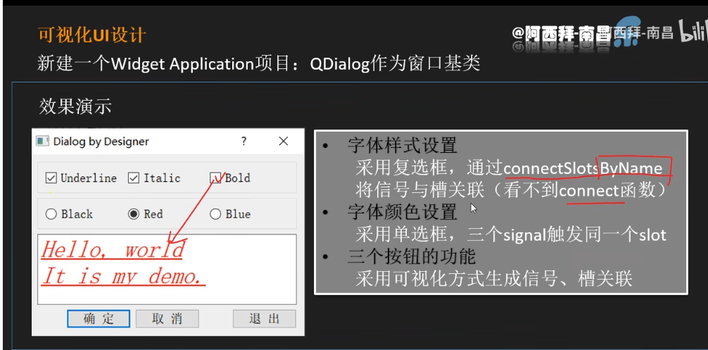
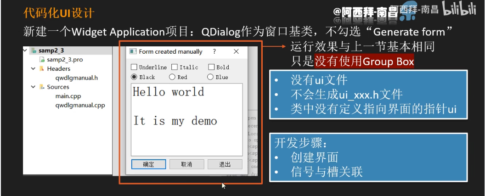
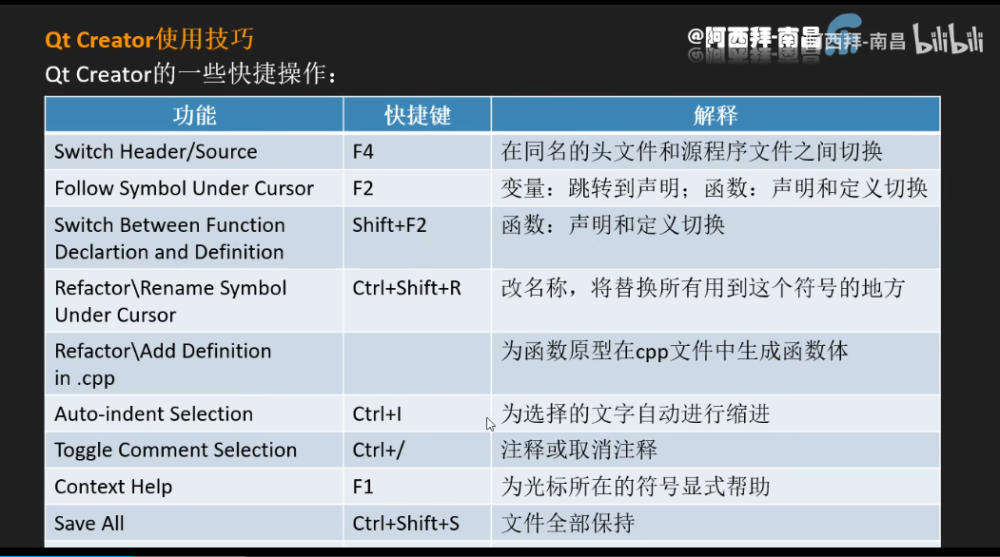
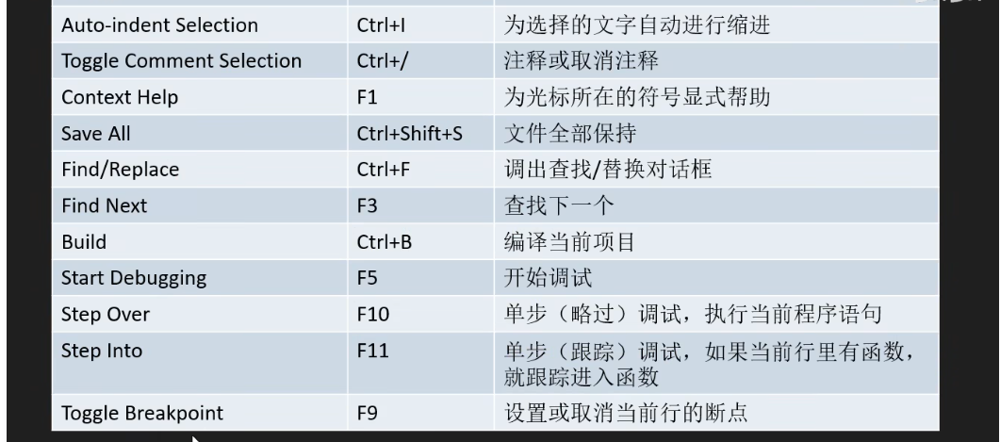
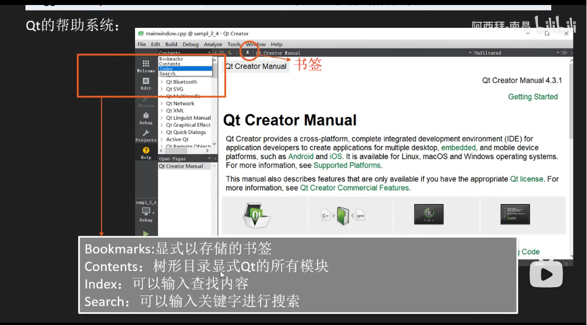

# ui设置


# 可视化UI设计

> 直接通过desinger设置的ui，用于灵活性不高的项目




## clion与qt_creator联动

> 他们俩是可以同时部署给同一个项目的！

1. 设置双方的build文件夹为同一个(不同的话会生成两个cache文件而冲突)
2. 双方读取cmakelist文件


## 连接槽

> 通过编写代码可以发现按钮是可以collect到类成员函数的，它们连接的方式在生成的ui_xxx.h文件里，右键按钮可以选择槽来连接，同时相应代码也会写入ui_xxx.h文件；如果是自定义函数去collect。则要把连接命令写在cpp里。

连接指令：

```c
QObject::connect(ok, SIGNAL(clicked()), mainwindow, SLOT(lower()));
```

插入到构造函数即可

```c++
mainwindow::mainwindow(QWidget *parent) : QWidget(parent), ui(new Ui::mainwindow) {
    ui->setupUi(this);
    //在这里
    QObject::connect(ok, SIGNAL(clicked()), mainwindow, SLOT(lower()));
}
```


# 代码化UI设计




## 流程

### 头文件

> 在头文件添加需要的qt类，并设置类成员变量

```c++
#include <QDialog>
#include <QCheckBox>
#include <QRadioButton>
#include <QPushButton>
#include <QPlainTextEdit>

QT_BEGIN_NAMESPACE
namespace Ui {
    class manual;
}
QT_END_NAMESPACE

class manual : public QDialog {
    Q_OBJECT

public:
    explicit manual(QWidget *parent = nullptr);
    ~manual() override;

private:
    QCheckBox *checkBoxUnderLine;
    QCheckBox *checkBoxItalic;
    QCheckBox *checkBoxBold;

    QRadioButton *blackBot;
    QRadioButton *redBot;
    QRadioButton *blueBot;

    QPlainTextEdit *plainEdit;

    QPushButton *okBot;
    QPushButton *cancelBot;
    QPushButton *quitBot;
};
```


### 图形界面

> 为指针成员变量new出空间，配置相关属性

**简单按钮**

先配置按钮属性，再将按钮加入布局

```c++
checkBoxUnderLine = new QCheckBox(tr("underline")); //配置按钮属性
```

```c++
    QHBoxLayout *layout = new QHBoxLayout;         //建立水平布局

    layout->addWidget(checkBoxUnderLine);          //将按钮赋权给水平布局
```

```c++
    QVBoxLayout *VLayout = new QVBoxLayout;        //建立垂直布局
    VLayout->addLayout(layout);					   //将水平布局布局赋权给垂直布局(子布局)
												//如果垂直析构，则水平也会析构
    setLayout(VLayout);                            //展示垂直布局
```


**弹簧**

```c
    QHBoxLayout *layout_chose = new QHBoxLayout;
    layout_chose->addStretch();                    //加在布局里面即可
    layout_chose->addWidget(okBot);
    layout_chose->addWidget(cancelBot);
    layout_chose->addStretch();
    layout_chose->addWidget(quitBot);
```

以上建议写在函数里面，并在构造时调用。


### 建立信号与槽

> connect到相应函数

```c++
connect(okBot, SIGNAL(clicked(bool)),this, SLOT(accept()));
```


流程通常都是三步走

- 抽离对象的模块赋值给指针

```c++
QPalette ple = plainEdit->palette();
```

- 对指针的配置进行修改

```c++
    if(redBot->isChecked())
        ple.setColor(QPalette::Text,Qt::red);
    else if(blueBot->isChecked())
        ple.setColor(QPalette::Text,Qt::blue);
    else if(blackBot->isChecked())
        ple.setColor(QPalette::Text,Qt::black);
```

- 重新赋值给对象

```c++
plainEdit->setPalette(ple);
```


# 混合方式UI设计

> 能用可视化就用可视化，可视化无法完成的需要手动代码

action: 实用的类，用于创建菜单项，工具栏按钮


## 默认槽函数connectSlotsByName()

> ```
> QMetaObject::connectSlotsByName(MainWindow)
> ```

递归搜索给定对象的所有子对象，并将来自这些子对象的匹配信号连接到以下形式的对象插槽：

void on_<object name>_<signal name>(<signal parameters>);

假设我们的对象有一个类型为QPushButton的子对象，对象名为button1。捕捉按钮的clicked（）信号的槽是：

void on_button1_clicked();


## 可复制状态copyAvailable()

> ```
> void MainWindow::on_text_edit_copyAvailable(bool b)
> ```

TextEdit类中通过转到槽选中`on_text_edit_copyAvailable(bool b)`


检查目前文字段是否可执行复制

```c
void MainWindow::on_text_edit_copyAvailable(bool b)
{
    ui->actcopy->setEnabled(b);
    ui->actpaste->setEnabled(ui->text_edit->canPaste());
    					//如果可以复制则按钮会显示
}
```


## 文字状态改变selectionChanged()

> ```
> void MainWindow::on_text_edit_selectionChanged()
> ```

TextEdit类中通过转到槽选中`selectionChanged()`。


选中文字后会影响斜体函数的状态

```c
  QTextCharFormat fmt;    
  fmt = ui->text_edit->currentCharFormat();  //赋值当前文字的状态
  ui->actitalic->setChecked(fmt.fontItalic()); //参数
							//如果是italic的话按钮就是按下的样式
  ui->actbigger->setChecked(fmt.font().bold());//参数
  ui->actunderline->setChecked(fmt.fontUnderline());//参数
```


## 文字大小改变Box 

> ```c++
> //自定义函数
> on_spinBoxFontSize_valueChanged(int aFontSize)
> 
> //connect
> connect(spinBox, SIGNAL(valueChanged(int)), this, SLOT(on_spinBoxFontSize_valueChanged(int)));
> ```


值改变时实现

```c
void MainWindow::on_spinBoxFontSize_valueChanged(int aFontSize)
{
  QTextCharFormat fmt;       //目标是临时变量的文字段
  fmt.setFontPointSize(aFontSize);//文字段改变大小
  ui->text_edit->mergeCurrentCharFormat(fmt);//将处理好的临时文字段合并进去
    //merge意味着不是直接全部覆盖，而是只对修改的部分merge。
    
  progressBar->setValue(aFontSize);//进度条也改变
}
```


另一个字体改变的的自定义函数

```c
void MainWindow::on_comboFont_currentIndexChanged(const QString &arg1)
{
  QTextCharFormat fmt;
  fmt.setFontFamily(arg1);
  ui->text_edit->mergeCurrentCharFormat(fmt);  //相同的merge
}
```


## 为应用程序设置图标

> https://www.cnblogs.com/Hakurei-Reimu-Zh/p/16259212.html


##  报错

- Object::connect: No such slot MainWindow::pushButton_clicked

> 错误原因有很多
>
> 1、看类声明中有没有Q_OBJECT
> 2、看slot函数有没有声明
>
> private slots:
> void xxxx();
> 3、查看slot有没有出现拼写错误～～～

我的错误是没有注意到QMetaObject::connectSlotsByName(MainWindow)

他是一个递归查找来者，能够把指定格式的函数connect。


- 承上：报错解决，按按钮没反映

我的错误是action里没有将checkabled勾选，也就是trigger()调用不了


- QMetaObject::connectSlotsByName: No matching signal for on_spinBoxFontSize_valueChanged(int)

> 在自定义函数on_spinBoxFontSize_valueChanged()后报错，这就是那个自动找槽的函数，因为自定义命名和它的搜索规范一样所以尝试去找。当然它肯定找不到，所以报错了。


- 文件不在项目栏里，但实际存在

> 是没有把新增文件写入camkelist的原因

```c
  add_executable(qt_person
    main.cpp
    widget.cpp
    widget.h
    widget.ui
    qperson.h
    qperson.cpp
    ${TS_FILES})
      //像这样写在函数里面
```


# 快捷键







> z在Help栏里面可以查找不同项




# 常用类

> https://blog.csdn.net/imxiangzi/article/details/77370549/

```c
QApplication 应用程序类　　　　　管理图形用户界面应用程序的控制流和主要设置    

QPalate  　　

QLabel 标签类　　　　　　　　　　提供文本或者图像的显示  　

QPushButton 按钮类　　　　　　　 提供了命令按钮 按钮的一种  　

QButtonGroup 按钮组合类　　　　　按钮组 相关按钮的组合  　

QGroupBox 群组类　　　　　　　　 一个有标题的组合框  　

QDateTimeEdit 日期时间编辑框类  　

QLineEdit 行编辑框类　　　　　　 单行文本编辑器  　

QTextEdit 文本编辑框类　　　　　 单页面多信息编辑器对象  　

QComboBox 组合框类  　

QProgressBar 进度条类  　

QLCDNumber 数字显示框类  　

QScrollBar 滚动条类  　

QSpinBox 微调框类  　

QSlider 滑动条类  　

QIconView 图标视图类  　

QListView 列表视图类  　

QListBox 列表框类  　

QTable 表格类  　

QValidator 有效性检查类  　

QImage 图像类  　

QMainWindow 主窗口类  　

QPopupMenu 弹出性菜单类  　

QMenuBar 菜单栏类  　

QToolButton 工具按钮类  　

QToolTip 提示类  　

QWhatsThis 这是什么类  　

QAction 动作类  　

QHBoxLayout 水平布局类  　

QVBoxLayout 垂直布局类  　

QGridLayout 表格布局类  　

QT对话框类  　

QMessageBox 消息对话框类  　

QProgressDialog 进度条对话框类  　

QWizard 向导对话框类  　

QFileDialog 文件对话框类  　

QColorDialog 颜色对话框类  　

QFontDialog 字体对话框类  　

QPrintDialog 打印对话框类

QFileInfo    显示文件信息类：主要作用是显示文件名字和文件路径，当然还有文件大小和最近修改时间（还有绝对路径和相对路径的关系）

QNetWorkInterface  提供网络接口  获取ip地址 

QNetworkRequest   QNetworkReply   QNetworkAccessManager  构建HTTP客户端

QMatrix  指定坐标系的2D变换-->  平移  纵移  缩放  旋转   通常在渲染图像的时候使

QTextCodeC      qt中用来进行编码转换的类（unicode和其他编码方式转换）

QSqlQuery       这个类封装了基本数据的一些基本语法操作（增删改查）,自动识别select等语句，返回true或者false报告状态

QSqlRecord       这个类封装了数据库的记录功能和特性。能从记录的数据中删除和添加字段，并且支持字段的查找功能（记录都是一条一条的）　

QPushButtonBox   这个类比单纯的使用pushbutton更加方便且更加美观。可以尝试使用这个类
```

