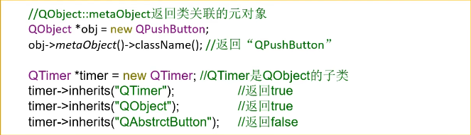
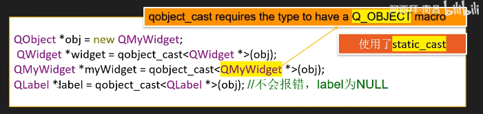
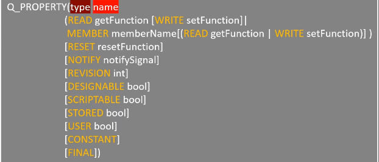
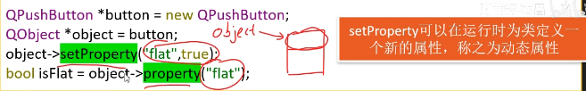
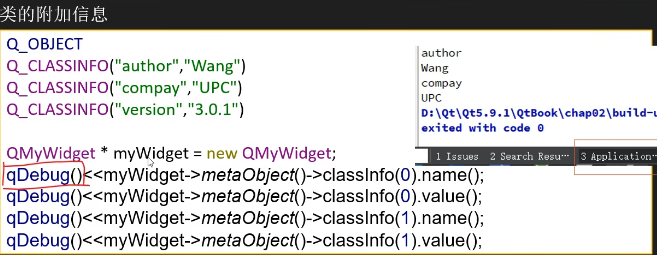
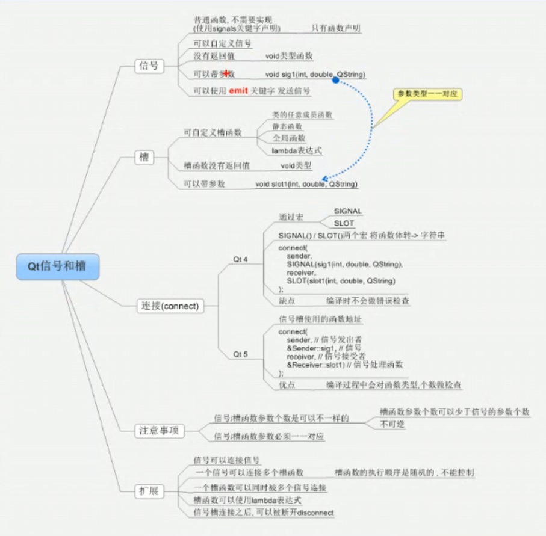
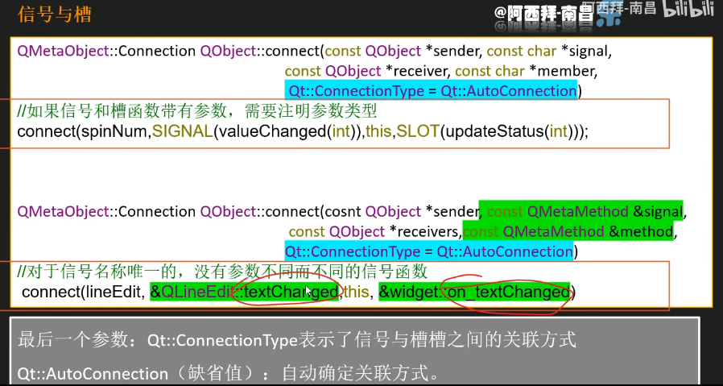
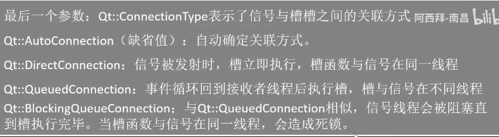
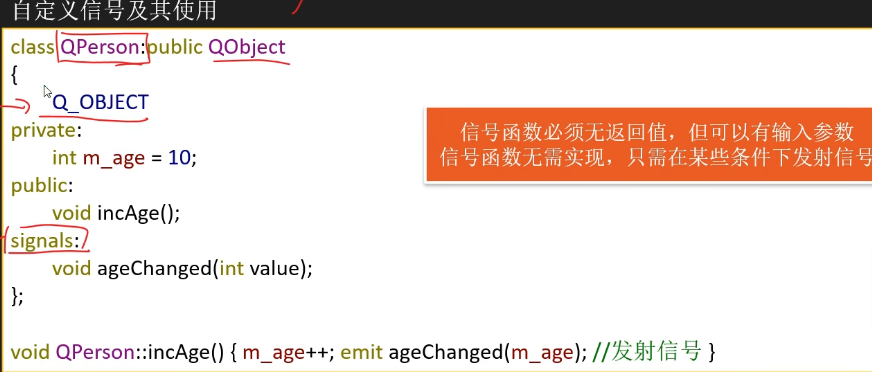
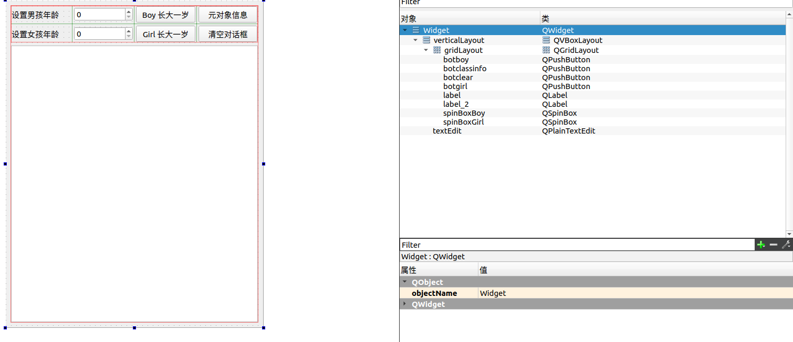

# Qt核心特点

## 元对象系统

> Qt对标准C++进行了扩展，引入了一些新的概念。
>
> 元对象编译器(MOC)是一个域处理器，先将Qt的特性程序转化为标准C++程序，再给C++编译器编译。

使用信号与槽机制，只有添加==Q_OBJECT==宏，moc才能对类里面的信号进行预处理。

新增的机制：信号与槽，属性系统，动态类型转换


**元对象系统**

- QObject类是所有元对象系统的类的基类
- 在一个类的private部分使用Q_OBJECT宏
- moc为每个object子类提供了必要代码



```c
timer->inherits("xxx")   //判断是否是xxx类或其子类
```




```c
QObject -> QWidget -> QMyWidget
先用基类指针变量指向一个派生类指针，此时基类指针只能获取自己基类的部分
通过强制类型转换，赋值给一级派生类QWidget，此时能访问QWidget部分
再用QMyWidget，同理
    
//注意如果又转换为QLabel，不会报错但是内容为NULL
```


## 属性系统

> ==Q_PROPERTY==宏定义了一个返回类型为type，名称为name的属性
>
> 我们自己派生类的时候可以向类加入函数



```c
上文
    []指内容为可选
    | 指或(or)
```


举例：

 ```c++
 class QMyWidget: public QWidget
 {
     Q_OBJECT
         Q_PROPERTY(bool focus READ hasFocus)   //返回值bool，宏名字叫focus有一个hasFocus函数，这些函数内容是自己写的
         Q_PROPERTY(bool enabled READ isEnabled WRITE setEnabled)
         Q_PROPERTY(Qcursor cursor READ cursor WRITE setCursor RESET unsetCursor)
 }
 ```




```c
object->property("flat")调用一个宏判断属性 ，判断是否有属性flat
```


**类的附加信息**



```c
通过控制台输出
    classinfo(0)表示第一项，例如"author"
```


## 信号与槽

> 信号槽的优点：松散耦合，信号发送与接受本身没有关联，通过connect耦合在一起。一个信号可以连接多个槽函数，多个信号可以连接多个槽函数，信号与槽的参数必须一一对应。
>
> ==信号的参数可以多于槽的参数，不过类型要一一对应==

> 基本格式：
>
> connect(信号发送者，发送的具体信号(函数的地址)，信号的接受者，信号的处理(槽))；






```c
图上有两种conncet形式，区别如注释所示
```


> 常见的按钮触发信号：
>
> ```c
> pressed();
> released();
> clicked();
> toggled(bool);
> ```
>
> 当鼠标[光标](https://so.csdn.net/so/search?q=光标&spm=1001.2101.3001.7020)在按钮上时，鼠标左键被按下时，pressed()被发送；当鼠标左键被释放时，released()被发送；
>
> toggle 类似开关。 具有2个状态，打开/关闭。  使用这个信号，是在这2个状态之间切换。checkable按纽或是图标的槽函数应该用toggled()事件来激活


值得注意的是，由于部分对象的信号与槽是来自于父类的，所以在connect()函数中既可以用对象的命名空间，也可以用对象的父类的命名空间

> 原因是函数是非virtual函数，静态联编，父类子类共用一个函数地址

```c
//二者等价
connect(myBtn, &MyPushButton::clicked, this, &myWidget::close);
connect(myBtn, &QPushButton::clicked, this, &QWidget::close);
```


**最后一个参数**



```c
connect()的最后一个参数可以缺省，是有关于槽什么时候执行的
```


**获取槽函数发射者的指针**

```c++
QSpinBox *spinbox = qobject_cast<QSpinBox*>(sender());
```


### 自定义信号

> 信号与槽是QObject类机制，所以需要对QObiect类进行派生
>
> 自定义信号写在类的signals底下，槽函数写在public slots下(高级qt版本不需要)



```c
intAge()；    //触发后执行的函数，emit发送信号
ageChanged(); //是信号函数，无需实现，执行后对外发布
```

**signal**

- signals信号没有返回值(void)
- 只需要申明，不需要定义
- 可以有参数，支持重载


**slots**

- 返回值void，需要申明，需要定义
- 可以有参数，可以重载


**代码串**

```c++
//类部分
class Student : public QObject
{
    Q_OBJECT
public:
    explicit Student(QObject *parent = nullptr);

signals:

public slots:
    void treat();  //这里

};

class Teacher : public QObject
{
    Q_OBJECT
public:
    explicit Teacher(QObject *parent = nullptr);

signals:
    void hungry(); //信号

};
```


```c
//为派生类Student的指针申请空间，使用this->来确保加入对象树
this->student = new Student(this);
```

```c
//触发信号
emit teacher->hungry();
	//emit是一个宏#define emit，它没做什么事，做标记用
```


连接

```c
    //必须是类下的&Widget::closeWinSlot，而不是对象下的&this->closeWinSlot
    connect(this,&Widget::closeWinSlot,this,&Widget::close_window);
```


### 信号重载

> 信号重载后，槽函数无法知晓到底要接收哪一个信号
>
> 解决办法:

只需将MainWindow.cpp中的接收信号那一步改一下就好了。

```c
 //错误的写法
 connect(this,&MainWindow::mysignal,this,&MainWindow::myslot3);  //无参
 connect(this,&MainWindow::mysignal,this,&MainWindow::myslot2);  //有参
```

正确方法是使用**函数指针**指向信号。

```c
 //无参
 void (MainWindow::*mysignalone)() = &MainWindow::mysignal;
 connect(this,mysignalone,this,&MainWindow::myslot3);

 //有参
 void (MainWindow::*mysignaltwo)(QString) = &MainWindow::mysignal;
 connect(this,mysignaltwo,this,&MainWindow::myslot2);
```

void (作用域::*函数指针名称)(参数) = &控件类名::信号名称;

作用域通常就是控件类名


**可以用QT4版本之前的写法，这种写法直观但是可读性较低且没有自检(不做类型检测，信号与槽容易写错)**

> 原因在与SIGNAL与SLOT只是把括号内的字符转换为字符串然后去寻找函数

```c
connect(this,SIGNAL(mysignal),this,SLOT(myslot3));//老式写法
connect(this,SIGNAL(mysignal(QString)),this,SLOT(myslot3(QString)));
```


这种情况下注意作用域，对connect的1，3参数要正确

```c
//成功示例
//connect(tea, hungry1, stu, &Student::treat);
    connect(this->tea, SIGNAL(hungry()), this->stu, SLOT(treat()));//无参也要加括号
    connect(this->tea, SIGNAL(hungry(QString)), this->stu, SLOT(treat(QString)));
```


### 断开信号连接

> 通过connect函数，我们可以连接信号与槽，相应的我们也能够断开指定的信号与槽的连接

```c++
connect(this,mysignalone,this,&MainWindow::myslot3);

disconnect(this,mysignalone,this,&MainWindow::myslot3);
```

之后mysignalone信号的发射不会影响到myslot3


# 实例

## 年龄增长

> 建立新项目，插入由QObject派生而出的QPerson类。

