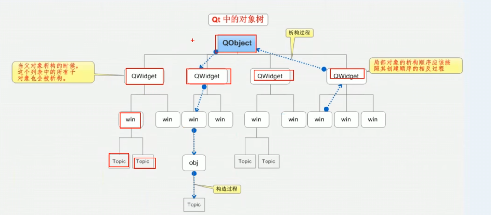

# 4_对象树

> Qt的对象保持着树状延伸，在窗口关闭时执行的析构函数中对象会自动释放，另一方面我们也可以通过设置父对象的操作来让一个对象与另一个对象绑定————例如删除一个窗口时另一个窗口也随之关闭。




## 设置父窗口

> 设置父窗口来让控件显示在父窗口上
>
> qt中设置父窗口后，在父窗口销毁时会自动执行内存回收

```c++
QPushButton *closeWin = new QPushButton；
closeWin->setParent(this);
closeWin->move(100,200);//在窗口内移动的相对坐标
//close->setGeometry(100,300);移动到用户屏幕的相对坐标
```


我们也可以在定义一个变量的时侯设置父窗口

```c++
QPushButton *closeWin = new QPushButton(this);
closeWin->move(100,200);
```


## 坐标系


**窗口**

```c
//重置窗口大小
resize(m,n);

//设置固定窗口大小
setFixedSize(m,n);

//设置窗口标题
setWindowTitle("name");
```

```c
//控件
myBtn->move(x,y)
//setGeometry(100,300);移动到用户屏幕的相对坐标
```


