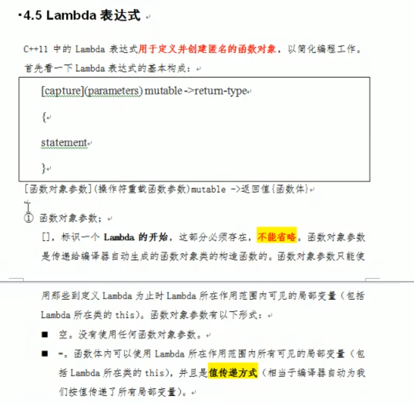
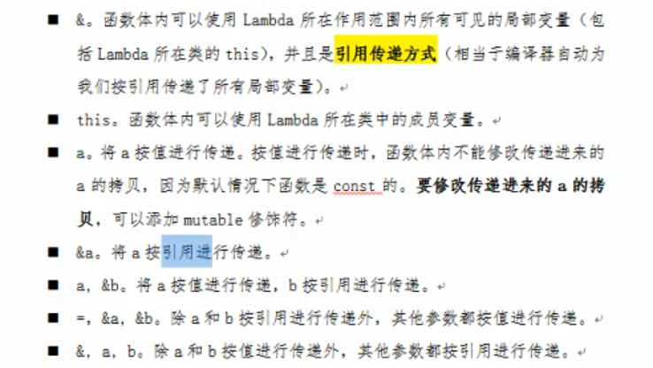
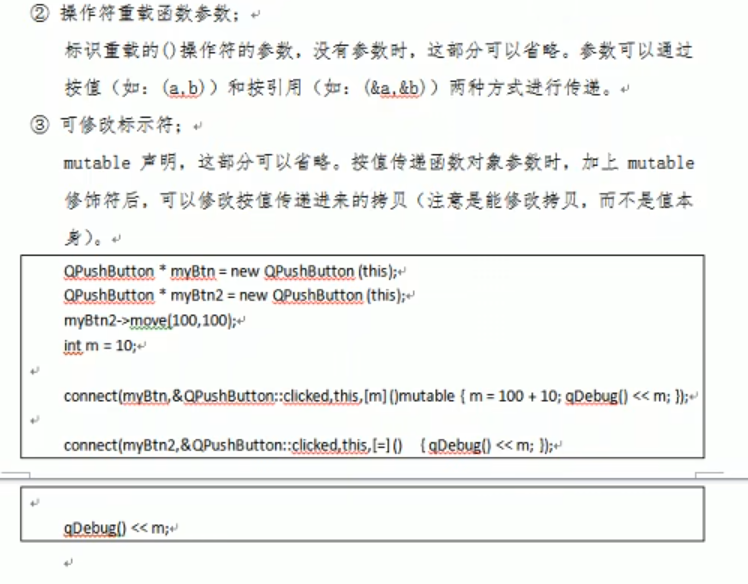
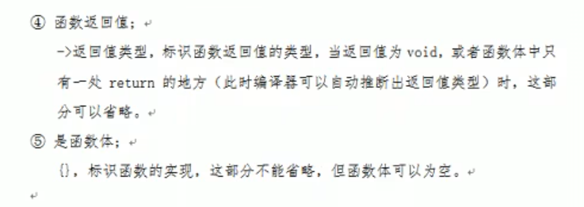

# Lambda表达式_qt

> 我们可以在qt中使用lambda表达式，不过注意如果是早期版本需要在pro中加入`CONFIG += C++11`以支持lambda表达式的使用
>
> ```c
> 最常用:
>     [=](){}
> ```
>
> 





```c
另外，也可以在[]内写入单独的变量名，此时作用只对这个变量生效
    
对于[=]按值传递，实际上传递的是指针，按值传递后的复制指针可以改变自己的指向，但不会影响原来指针的指向
```




```c
我们一定要使用mutable才可进行值修改的操作，即使这些值是按值传递的。因为传入的值带有const属性
    []()mutable{};
```




```c
//返回值
int a = []()->int{return 1000}();
```


## 简单实例

```c++
//一个lambda表达式的申明
[](){};

//在函数里使用
std::sort(a,b,[](int a,int b){return a > b});

//如果想要单独单独调用
[](){}();
```


设置一个按钮connect到lambda表达式上

```c++
    QPushButton *closeWin = new QPushButton(this);  //设置到对象树
    closeWin->move(100,200);

    //必须是类下的&Widget::closeWinSlot，而不是对象下的&this->closeWinSlot
    connect(this,&Widget::closeWinSlot,this,&Widget::close_window);
	
	//连接，如此一来在lambda表达式里我们可以干很多事
    connect(closeWin,&QPushButton::clicked,this,[=](){this->close();});

```

