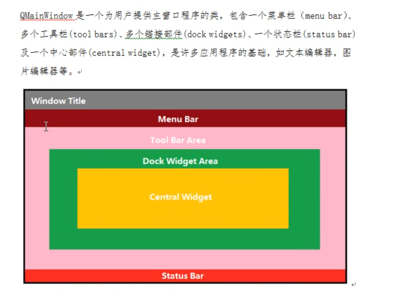
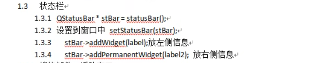
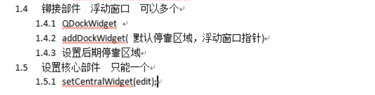
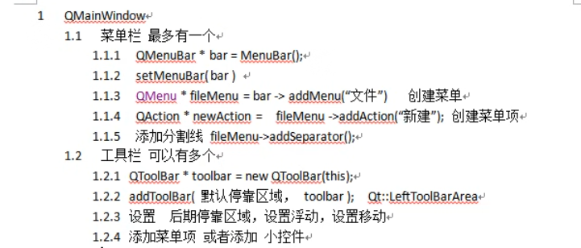

# QMainWindow菜单栏

> QWidge是一个空窗口，现在我们来了解菜单栏QMainWindow。
>
> QWidge包括菜单栏(**至多一个**)，工具栏，锚接部件(浮动窗口)，状态栏，中心部件



## ToolBar工具栏

> 是工具栏，父类是Widge。通常依靠在窗口边缘，但也可以在窗口内浮动

### 成员函数

| [actionAt](qtoolbar.html#actionAt)(const QPoint &*p*) const  |                        |
| ------------------------------------------------------------ | ---------------------- |
| [actionAt](qtoolbar.html#actionAt-1)(int *x*, int *y*) const |                        |
| [addAction](qtoolbar.html#addAction)(const QString &*text*)  |                        |
| [addAction](qtoolbar.html#addAction-1)(const QIcon &*icon*, const QString &*text*) |                        |
| [addAction](qtoolbar.html#addAction-2)(const QString &*text*, const QObject **receiver*, const char **member*) |                        |
| [addAction](qtoolbar.html#addAction-3)(const QIcon &*icon*, const QString &*text*, const QObject **receiver*, const char **member*) |                        |
| [addAction](qtoolbar.html#addAction-4)(const QString &*text*, Functor *functor*) |                        |
| [addAction](qtoolbar.html#addAction-5)(const QString &*text*, const QObject **context*, Functor *functor*) |                        |
| [addAction](qtoolbar.html#addAction-6)(const QIcon &*icon*, const QString &*text*, Functor *functor*) |                        |
| [addAction](qtoolbar.html#addAction-7)(const QIcon &*icon*, const QString &*text*, const QObject **context*, Functor *functor*) |                        |
| [addSeparator](qtoolbar.html#addSeparator)()                 |                        |
| [addWidget](qtoolbar.html#addWidget)(QWidget **widget*)      |                        |
| [allowedAreas](qtoolbar.html#allowedAreas-prop)() const      |                        |
| [clear](qtoolbar.html#clear)()                               |                        |
| [iconSize](qtoolbar.html#iconSize-prop)() const              |                        |
| [insertSeparator](qtoolbar.html#insertSeparator)(QAction **before*) |                        |
| [insertWidget](qtoolbar.html#insertWidget)(QAction **before*, QWidget **widget*) |                        |
| [isAreaAllowed](qtoolbar.html#isAreaAllowed)(Qt::ToolBarArea *area*) const |                        |
| [isFloatable](qtoolbar.html#floatable-prop)() const          |                        |
| [isFloating](qtoolbar.html#floating-prop)() const            |                        |
| [isMovable](qtoolbar.html#movable-prop)() const              | 限制移动               |
| [orientation](qtoolbar.html#orientation-prop)() const        |                        |
| [setAllowedAreas](qtoolbar.html#allowedAreas-prop)(Qt::ToolBarAreas *areas*) | 限制停靠方向           |
| [setFloatable](qtoolbar.html#floatable-prop)(bool *floatable*) | 限制能否以浮动窗口存在 |
| [setMovable](qtoolbar.html#movable-prop)(bool *movable*)     |                        |
| [setOrientation](qtoolbar.html#orientation-prop)(Qt::Orientation *orientation*) |                        |
| [toggleViewAction](qtoolbar.html#toggleViewAction)() const   |                        |
| [toolButtonStyle](qtoolbar.html#toolButtonStyle-prop)() const |                        |
| [widgetForAction](qtoolbar.html#widgetForAction)(QAction **action*) const |                        |


### 排布方式

> ==qt的枚举都是以Qt::开头的==
>
> 在查找中找到QToolBar后，发现通过`addToolar(枚举，toolbar_name);`可以设置工具栏的停靠位置，枚举：

```c
Qt::LeftToolBarArea
0x1
Qt::RightToolBarArea
0x2
Qt::TopToolBarArea
0x4
Qt::BottomToolBarArea
0x8
Qt::AllToolBarAreas
ToolBarArea_Mask
Qt::NoToolBarArea
0
```


### 限制停靠

> 通过`setAllowedAreas(Qt::ToolBarAreas areas);`可以限定停靠位置，枚举：

```
Qt::LeftToolBarArea
0x1
Qt::RightToolBarArea
0x2
Qt::TopToolBarArea
0x4
Qt::BottomToolBarArea
0x8
Qt::AllToolBarAreas
ToolBarArea_Mask
Qt::NoToolBarArea
0
```


## StatusBar状态栏

> 最多有一个，单一 的部件初始化是不需要new的，而是调用一个函数



```c++
//状态栏，至多一个
QStatusBar *stBar = statusBar();
setStatusBar(stBar);

//标签控件
QLabel *label1 = new QLabel("提示信息",this);
stBar->addWidget(label1);

QLabel *label2 = new QLabel("右侧提示",this);
stBar->addPermanentWidget(label2);
```


## 铆接部件

> 又称浮动窗口，可添加多个。区别各类部件能否添加多个或仅有一个的标志是看部件的加入函数是`addXXX()`还是`setXXX()`



```c++
//铆接部件（浮动窗口），可多个
QDockWIdget *dockWidget = new QDockWidget("浮动",this);
addDockWidget(Qt::BottomDockWidgetArea,dockWidget);
//设置后期停靠区域，只允许上下
dockWidget->setAllowedAreas()

//该部件的位置是围绕核心的,现在设置中心部件
QTextEdit *edit = new QTextEdit(this);
setCentralWidget(edit);
```


### 限制停靠

> 通过`setAllowedAreas(枚举)`可以限制停靠位置

```c
Qt::LeftDockWidgetArea
0x1
Qt::RightDockWidgetArea
0x2
Qt::TopDockWidgetArea
0x4
Qt::BottomDockWidgetArea
0x8
Qt::AllDockWidgetAreas
DockWidgetArea_Mask
Qt::NoDockWidgetArea
0
```


# 实例

## 入门

> 建立一个简单的菜单栏




```c++
//重置窗口大小
resize(600,400);


#include <QMEenBar>
//菜单栏创建  至多一个
QMenuBar * bar = menuBar();
 //菜单栏加入新窗口,此时菜单栏里没有东西，所有我们在窗口里什么也看不到
setMenuBar(bar);

 //创建菜单
QMenu *fileMenu = bar->addMenu("文件");
QMenu *editMenu = bar->addMenu("编辑");

 //创建菜单项，点击菜单后出现
QAction *newAction = fileMenu->addAction("新建");//新建一个action并赋值给一个action变量
QAction *openAction = fileMenu->addAction("打开");

 //隔离菜单项（分割线）
fileMenu->addSeparator();
fileMenu->addMenu("打开");


#include <QToolBar>
//工具栏 可以有多个
QToolBar * toolBar = new QToolBar(this);
addToolBar(toolBar);

 //设置toolbar的默认排布
addToolBar(Qt::LeftToolBarArea,toolBar);  //设置停靠方式

 //只允许左右停靠
toolBar->setAllowedAreas(Qt::LeftToolBarArea | Qt::RightToolBarArea);

 //限制移动
toolBar->setMovable(false);

 //设置内容,菜单栏里能用的工具栏也能用
toolBar->addAction(newAction);
toolBar->addSeparator();//分割线
toolBar->addAction(openAction);

 //工具栏添加控件
QPushButton * btn = new QPushButton("aa",this);
toolBar->addWidget(btn);
```


