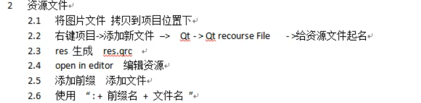
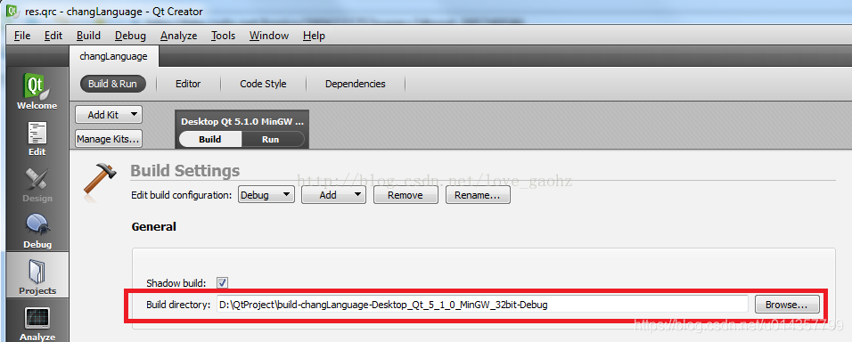
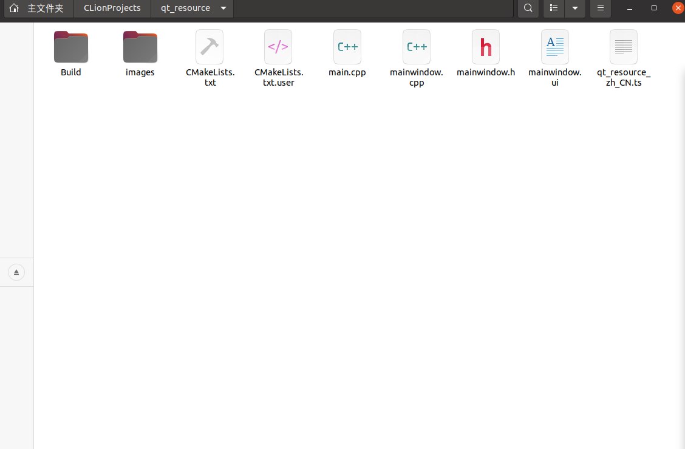

# 资源文件添加

> 在QMainWindow中我们已经设立了一些部件，现在我们来设置图标。通常有相对路径读取和资源文件读取两种方法

```c++
//QAction *actionNew = new QAction;

//基本格式
ui->actionNew->setIcon(QIcon(“文件路径“));//路径名不可有中文
```




## 相对路径搜索

这里的文件路径会涉及相对路径和绝对路径：

> ①绝对路径：`QApplication::applicationDirPath();`是**获取的执行文件exe所在的路径**（qdebug的路径）。
>  ②相对路径：QtCreater所用到的相对路径。在QtCreater中的`“./”`这个路径是**bulid directory的路径**。在QtCreater中可以手动设置。如图：




举例

```c++
//Build地址改为项目内的Build文件夹后，在项目文件夹里加入images文件夹用于存储图片

ui->actionNew->setIcon(QIcon("../images/btn_next.png"));//图片名字(随便取的)
```




## 资源文件搜索

> 通过Qt resource file我们可以向项目添加文件

用.pro文件构建项目的直接新建qrc文件即可，因为我使用CMake构建项目，所以在新建.qrc文件后需要手动在camkelist.txt文件中修改`add_executable()`：

```c++
  add_executable(qt_resource //项目名称
    main.cpp
    mainwindow.cpp
    mainwindow.h
    mainwindow.ui
    res.qrc   //添加.qrc文件
    ${TS_FILES}
  )
```


这时我们可以在项目栏里编辑qrc文件了，右键它，选择"Open in Editor"进入资源添加。

**前缀**：用于图片的区分，如果不需要前缀直接输入`/`即可


### 使用资源

```c++
//使用添加的Qt资源": + 前缀名 + 文件名"

ui->actionNew->setIcon(QIcon(":/images/btn_next.png"));
```

