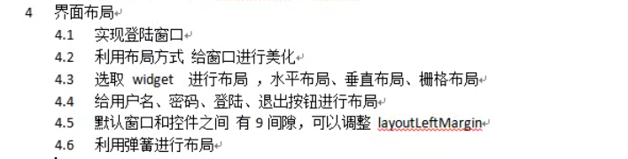
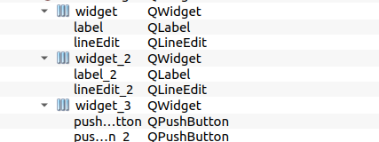

# 对话框


## 模态和非模态对话框

> **模态对话框**：（不可以对其他窗口进程）
>
> **非模态**：（可以对其他窗口操作）
> 例：qt界面打开"关于"时我们可以对主窗口继续操作，但打开“插件”时就无法操作


```c++
    //点击新建按钮，弹出对话框
    connect(ui->action_open,&QAction::triggered,[=](){
        //对话框 分类
        //模态对话框：（不可以对其他窗口进程）非模态：（可以对其他窗口操作）
        //例：qt界面打开"关于"时我们可以对主窗口继续操作，但打开“插件”时就无法操作
        QDialog dlg(this);
        dlg.resize(200,100);
        dlg.exec();//模态

        qDebug() << "模态对话框弹出";


        //这种情况下非模态窗口对象会因为在匿名函数中而被释放
        //QDialog dlg2(this);

        //选择动态创建，将对象放在堆上以避免自动释放
        QDialog *dlg2 = new QDialog(this);
        
        dlg2->show();//非模态，注意该对象此时会在按钮点击中反复创建
        
        dlg2->setAttribute(Qt::WA_DeleteOnClose);//为了规避反复创建，添加55号属性
        // 当该窗口接受关闭事件时会让Qt删除该窗口。这个删除它是会删除包括在堆上的窗口。
        
        qDebug() << "非模态对话框弹出";
    });

//connect()的参数是三个：使用lambda表达式不需要指定链接的对象，直接说明操作即可
```


**Qt::WA_DeleteOnClose**

如果我们在程序中通过 new 的方式创建一个窗口，可以给该窗口设置 `Qt::WA_DeleteOnClose`属性。这样在关闭这个窗口时Qt能够自动回收该窗口所占用的资源，这样能够及时回收无效的资源，有用利于节约内存空间。


### 属性Widget::setAttribute()

```c++
属性是用QWidget::setAttribute()设置和清除的。用QWidget::testAttribute()查询是否设置了某种属性。有些属性特殊便捷函数可以设置。

    Qt::WA_AcceptDrops：接受拖放，QWidget::setAcceptDrops()是此设置的便捷函数。
    Qt::WA_AlwaysShowToolTips：设置窗口（注意是窗口，当QWidget作为子部件时无效）为非活动时也显示提示信息。（setToolTip()设置了窗口提示信息）
    Qt::WA_CustomWhatsThis：设置小部件在“这是什么？”模式中继续正常运行。
    Qt::WA_DeleteOnClose：QWidget关闭时被delete。
    Qt::WA_Disabled：设置小部件（注意是小部件，对窗口无效）被禁用（相对于调用setEnabled(false);）。
    Qt::WA_DontShowOnScreen：不显示，相当于调用hide()。
    Qt::WA_ForceUpdatesDisabled：禁用更新，即使其所有祖先都设置为启用更新状态，它仍将保持禁用状态。（相当于调用QWidget::setUpdatesEnabled()）。
    Qt::WA_Hover：当鼠标进入或离开小部件时，强制Qt生成绘制事件。此功能通常在实现自定义样式时使用。
    Qt::WA_InputMethodEnabled：启用亚洲语言的输入法。创建自定义文本编辑小部件时必须设置。
    Qt::WA_KeyboardFocusChange：当用户使用键盘（tab、backtab或快捷键）时更改焦点。用于顶层窗口设置。
    Qt::WA_KeyCompression：如果设置则启用按键事件压缩，如果未设置则禁用它。默认情况下，按键压缩是关闭的，所以小部件每次按键都会收到按键事件。如果启用并且程序跟不上按键输入，Qt 可能会尝试压缩按键事件，以便在每个事件中可以处理多个字符。Qt 仅对可打印字符执行按键事件压缩。 Qt::Modifier 键、光标移动键、功能键和其他操作键（例如 Escape、Enter、Backspace、PrintScreen）将停止键事件压缩。
    Qt::WA_LayoutOnEntireRect：小部件希望布局对整个QWidget::rect()操作，而不仅仅是在QWidget::contentsRect()上。
    Qt::WA_LayoutUsesWidgetRect：使用 QLayout 布局小部件时，忽略样式中的布局项 rect。
```


## 窗口置于顶层

> https://blog.csdn.net/hl1hl/article/details/85244451


## 消息对话框

QMessgaeBox是一系列qt预先准备的对话框，用于提示用户。


```c++
//消息对话框
QMessageBox::XXX(1，2，3，4，5);
        //参数1：父亲  参数2：标题   参数3：内容   参数4:关联参数的类型   参数5：回车默认的参数

            //错误对话框
        QMessageBox::critical(this,"critical","错误");

            //信息对话框
        QMessageBox::information(this,"info","信息");

            //提问对话框
        QMessageBox::question(this,"ques","提问",QMessageBox::Save| QMessageBox::Cancel,QMessageBox::Cancel);
        //因为函数返回按下的参数所以我们可以用if来执行想要的步骤
//        if(QMessageBox::Save == QMessageBox::question(this,"ques","提问",QMessageBox::Save| QMessageBox::Cancel,QMessageBox::Cancel))
//        {
//            ...
//        }

            //警告对话框
        QMessageBox::warning(this,"warn","警告");
```


### 其他按键参数

> 即对话框的参数4

```c

QMessageBox::Ok
QMessageBox::Open
QMessageBox::Save
QMessageBox::Cancel
QMessageBox::Close
QMessageBox::Discard
QMessageBox::Apply
QMessageBox::Reset
QMessageBox::RestoreDefaults
QMessageBox::Help
QMessageBox::SaveAll
QMessageBox::Yes
QMessageBox::YesToAll
QMessageBox::No
QMessageBox::NoToAll
QMessageBox::Abort
QMessageBox::Retry
QMessageBox::Ignore
QMessageBox::NoButton

```


## 颜色对话框

> 选择需要的颜色，会返回选中的颜色

```c++
//颜色对话框
[static] QColor QColorDialog::getColor(const QColor &initial = Qt::white, QWidget *parent = nullptr, const QString &title = QString(), QColorDialog::ColorDialogOptions options = ColorDialogOptions())
   
    
QColor color = QColorDialog::getColor(QColor(255,0,0,50));//可以获取颜色，第四个参数是Alpha透明度
        qDebug() << "r:" << color.red() << "g: " << color.green() << "b: " << color.blue();
```


## 文件对话框

> 打开选中的文件，会返回选中的地址(取消会返回空引号`“”`)

```c++
//文件对话框
[static] QString QFileDialog::getOpenFileName(QWidget *parent = nullptr, const QString &caption = QString(), const QString &dir = QString(), const QString &filter = QString(), QString *selectedFilter = nullptr, QFileDialog::Options options = Options())
	//参数1：父亲  参数2：打开的路径(缺省为项目路径)  参数3：过滤的文件(多个类型以空格区分)
    QSrting dir = QFileDialog::getOpenFileName(this,"打开","../","(*.txt *.h)");
```


## 字体对话框

> 打开字体选择框，返回选中的字体，如果单击“确定”，则返回所选字体。 如果单击“取消”，则返回初始字体。

```c
//字体对话框
[static] QFont QFontDialog::getFont(bool *ok, const QFont &initial, QWidget *parent = nullptr, const QString &title = QString(), QFontDialog::FontDialogOptions options = FontDialogOptions())
    
	//参数1: bool 如果参数1为null，则在用户单击“确定”时将其引用的值设置为true，在用户单击“取消”的情况下将其设置为false
	//参数2：初始字体
    bool flag;
    QFont font = QFontDialog::getFont(&flag,QFont("华文彩云",36));	//默认字体和字号

	qDebug() << "字体：" << font.family().toUtf8().data() << "字号：" << font.pointSize() << "是否加粗：" << font.bold() << "是否斜体：" << font.italic();
```


# 登陆界面布局

> 想要作出美观的ui界面，学习布局必不可少



我们可以通过选中部件然后单击布局的方式对部件进行布局，不过我们更推荐先将部件塞入Widget控件后，再对Widget控件进行单击布局来处理




当我们想要对nxm排布的控件集对齐时使用格栅布局更合适


对最大的窗口设置布局后窗口可以随着拉伸而变形，通过加入弹簧使得控件位于合适的位置


固定窗口大小：将窗口属性里的最大，最小值改成相同值即可。如果只是希望在垂直/水平方向上拉伸，则更改相应的水平/垂直策略为Fixed。


边界大小：在Widget窗口属性的Layout栏中可以看到各项边界的值

madding是内间距，margin是外间距


密码输入框不显示：在edit控件的属性中找到echoMode，选择Passward


获取文本框内容

```c
//以纯文本的方式获取文本框的内容(不含格式)
QString strText=ui->textEdit.text();
```


```c++
    //pressed是监听鼠标按下,clicked是监听鼠标按下并松开那一刻才会发射信号
    connect(ui->in_btn,&QPushButton::clicked,this,[=](){
        name = ui->name_edit->text();
        passward = ui->passward_edit->text();

        if(name != "" && passward != "")
            qDebug() << "账户: " << name;
        else
        {
            qDebug() << "输入不完全";
            QMessageBox::critical(this,"错误","用户或密码输入不正确");
        }

        std::vector<std::pair<int,QString>>::iterator t;
        t = std::find(user.begin(),user.end(),std::make_pair(name.toInt(),passward));
        if(t != user.end())
            QMessageBox::information(this,"info","账户查找成功");
        else
            QMessageBox::critical(this,"错误","用户或密码输入不正确");
    });

    connect(ui->cancel_btn,&QPushButton::clicked,this,&QMainWindow::close);
```
