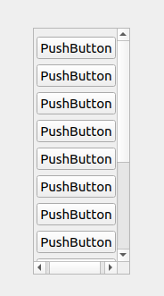
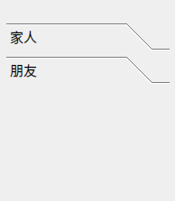
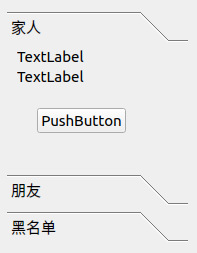
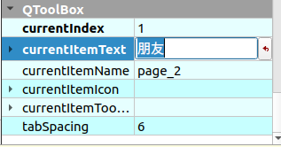
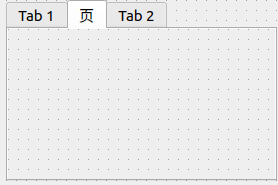
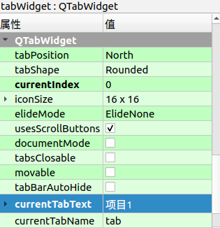
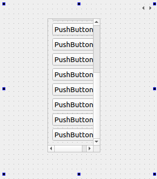

# Containers控件


## Scroll Area控件

> 滚动控件

### 

> > QScrollBar提供了垂直或水平滚动条。滚动条通常配有其他控件，使导航更加精确。
> >
> > 信号：
> >
> > 1. valueChanged() -- 当滚动条的值已经发生改变时，被发射。tracking()决定在用户操作期间，这个信号是否被发射。
> > 2. sliderPressed() -- 当用户开始拖动滑块时，被发射。
> > 3. sliderMoved() -- 当用户拖动滑块时，被发射。
> > 4. sliderReleased() -- 当用户释放滑块时，被发射。
> > 5. nextLine() -- 当滚动条已经向下或向右移动了一个线步时，被发射。线步在QRangeControl中被定义。
> > 6. prevLine() -- 当滚动条已经向上或向左移动了一个线步时，被发射。
> > 7. nextPage() -- 当滚动条已经向下或向右移动了一个页步时，被发射。
> > 8. prevPage() -- 当滚动条已经向上或向左移动了一个页步时，被发射。
> >
> > ```cpp
> > //横显示/竖显示
> > scrollBar->setOrientation(Qt::Horizontal);
> > //控制条宽度
> > scrollBar->setPageStep(10);
> > //初始值
> > scrollBar->setValue(50);
> > ```



```c
//自定义
/*
https://www.it610.com/article/1187889283181158400.htm
*/
QScrollBar:vertical
{
    width:8px;
    background:rgb(0,0,0,0%);
    margin:0px,0px,0px,0px;
    padding-top:12px;   /*上预留位置*/
    padding-bottom:12px;    /*下预留位置*/
}
 
/*滚动条中滑块的样式*/
QScrollBar::handle:vertical
{
    width:8px;
    background:rgb(0,0,0,25%);
    border-radius:4px;
    min-height:20px;
}
 
/*鼠标触及滑块样式*/
QScrollBar::handle:vertical:hover
{
    width:9px;
    background:rgb(0,0,0,50%);
    border-radius:4px;
    min-height:20;
}
 
/*设置下箭头*/
QScrollBar::add-line:vertical
{
    height:12px;
    width:10px;
    border-image:url(:/KeyManager/images/icon_pull-down.png);
    subcontrol-position:bottom;
}
 
/*设置上箭头*/
QScrollBar::sub-line:vertical
{
    height:12px;
    width:10px;
    border-image:url(:/KeyManager/images/icon_pull-up.png);
    subcontrol-position:top;
}
 
/*设置下箭头:悬浮状态*/
QScrollBar::add-line:vertical:hover
{
    height:12px;
    width:10px;
    border-image:url(:/KeyManager/images/icon_pull-down2.png);
    subcontrol-position:bottom;
}
 
/*设置上箭头：悬浮状态*/
QScrollBar::sub-line:vertical:hover
{
    height:12px;
    width:10px;
    border-image:url(:/KeyManager/images/icon_pull-up2.png);
    subcontrol-position:top;
}
 
/*当滚动条滚动的时候，上面的部分和下面的部分*/
QScrollBar::add-page:vertical,QScrollBar::sub-page:vertical
{
    background:rgb(0,0,0,10%);
    border-radius:4px;
}
```


## ToolBox控件

> 页表，每一个页可以打开






对标签内容的修改在属性里




**新建页**：右键控件，选择插入页


## Tab Widget控件

> 网页控件，与too box类似，不过页变成置顶横向排布




对页名的修改在属性里




## Stacked Widget控件

> 栈容器，单页面切换窗口




开发模式下才有黑箭头，使用时我们需要用信号与槽绑定页面切换

```c++
//设置栈容器
	ui->setupUi(this);

//设置默认界面，防止随机
 ui->stackedWidget->setCurrentIndex(0);

    connect(ui->scro_scrollbtn,&QPushButton::clicked,[=](){
        //index值在栈的属性里看currentIndex
        ui->stackedWidget->setCurrentIndex(0);
    });

    connect(ui->scro_toolbtn,&QPushButton::clicked,[=](){
        ui->stackedWidget->setCurrentIndex(1);
    });

    connect(ui->scro_tabbtn,&QPushButton::clicked,[=](){
        ui->stackedWidget->setCurrentIndex(2);
    });
```


## Frame控件

> 边框


## Dock Widget浮动窗口