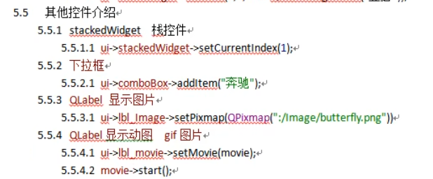
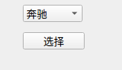

# Input Widgets控件




## Combo Box控件

> 下拉框



```c++
//下拉框
    ui->comboBox->addItem("奔驰");
    ui->comboBox->addItem("宝马");
    ui->comboBox->addItem("拖拉机");

    //点击按钮，显示拖拉机
    connect(ui->select_btn,&QPushButton::clicked,[=](){
        //方法一 ui->comboBox->setCurrentIndex(2);
        
        //方法二
        ui->comboBox->setCurrentText("拖拉机");
    });
```


## Font Combo Box控件

> 字体下拉框


## Text Edit控件

> 支持加粗，下划线等操作，Plain Text Edit就不行


## Spin Box控件

> 上下键选择框


## Scroll Bar控件

> 有框滑块部件


## Slider部件

> 无框滑块部件