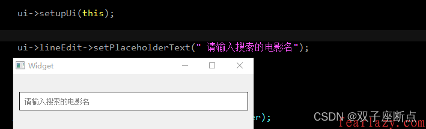

# TextEdit控件

基础：https://blog.csdn.net/qq_37529913/article/details/109217353

更多： https://www.cnblogs.com/yinsedeyinse/p/10793143.html

> 本文详细的介绍了TextEdit控件的各种操作，例如：获取内容、输入控件字符、保持在最后一行添加(自动滚屏)、定时关闭、添加数据换行、向鼠标位置插入一行字符、设置字体颜色属性等操作。


## 获取控件内字符

```c
    //获取TextEdit内所有内容
    QString text = ui->textEdit->toPlainText();
    ui->textEdit->insertPlainText(text +='\n');
```

获取文本框内容

```c
//以html的方式获取文本框的内容(含格式)
QString strHtml=ui->textEdit->document()->toHtml();

//以纯文本的方式获取文本框的内容(不含格式)
QString strText=ui->textEdit->document()->toPlainText();
```


## 在控件内添加字符

```c
QStr="插入字符";
ui->textEdit->insertPlainText(QStr);
```


##  保持在最后一行添加(自动滚屏)

```c
    //保持编辑器在光标最后一行
    QTextCursor cursor=ui->textEdit->textCursor();
    cursor.movePosition(QTextCursor::End);
    ui->textEdit->setTextCursor(cursor);
 
    QStr="添加一行";
    ui->textEdit->insertPlainText(QStr +='\n');
```


## 控件刷新(删除数据)

```c
    //如果超过一定行数清空一下
    if(ui->textEdit->document()->lineCount()>20)
    {
        ui->textEdit->clear();
    }
```


## 添加数据换行

```c
    QStr="插入换行,开始下一行输入";
    ui->textEdit->insertPlainText(QStr +='\n');
```


### \n换行符无效

正常打印

```c++
qDebug()<<QString::fromUtf8( "12345放的地方大幅度反弹辅导费\n45678\ndf"); 
```

由于有\n所以会换行

```c++
"12345放的地方大幅度反弹辅导费
45678
df" 
```

如果打印LineEdit等控件中输入的相同字符的话

```c++
qDebug()<<ui->lineEdit->text();//lineEdit中的字符为"12345放的地方大幅度反弹辅导费\n45678\ndf"
```

结果打印为：

    "12345放的地方大幅度反弹辅导费\n45678\ndf"

不会换行

这时我们应该替换\\n为\n：

```c++
ui->label->setText(ui->lineEdit->text().replace("\\n","\n"));
```

这时打印结果为：

```
"12345放的地方大幅度反弹辅导费
45678
df" 
```


## 向鼠标位置插入一行字符

```c
    //像当前鼠标位置插入一行
    ui->textEdit->textCursor().insertText(QStr+"\n");
```


## 设置字体颜色属性

```c
    //第一个属性是字体（微软雅黑），第二个是大小，第三个是加粗（权重是75）
    QFont textEditFont ( "Microsoft YaHei", 10, 75); 
    ui->textEdit->setFont(textEditFont);
    //设置颜色
    ui->textEdit->setStyleSheet("#textEdit{color:rgb(85, 170, 255);}");
    //ui->textEdit->setStyleSheet("#textEdit{border-radius: 10px;color:rgb(85, 170, 255);font: 75 16pt;font-weight: 100 16pt;}");
```


### 多行不同颜色

**方案1**

> 采用先保存好当前颜色，全局设置行色并加入要改色的字符，再换回原来的颜色的方法

```c
    // 先保存当前的文字颜色
    auto cur_text_color = m_textline->textColor();

    // 设置当前行要使用的颜色，假设为红色
    m_textline->setTextColor(Qt::red);

    // 写入一行内容
    QString str = u8"This a test line";
    m_textline.append(str);

    // 最后恢复原来的颜色
    m_textline->setTextColor(cur_text_color);
```

> QTextEdit一直append会有内存溢出问题
>
> 需要设置最大行数：
>
> ```
> ui->textEdit->document()->setMaximumBlockCount(100);
> 
> 或者手动当到达一定数量，自己手动清空。
> ```


**方案2**

> 全局改色

```c
//设置textEdit颜色
    QPalette palette= ui->receiveTextEdit->palette();
    palette.setColor(QPalette::Base, Qt::black);
    palette.setColor(QPalette::Text, Qt::green);
    ui->receiveTextEdit->setPalette(palette);
```


**方案3**

> 优质方法，之间append()函数设置颜色 #FF0000的是rgb符号，各两位16进制(16x16 = 256)

```c
    ui->tbMessage->append("<font color=\"#FF0000\">" + strMsg + "</font> ");
```

```c
QTextEdit *edit=new QTextEdit(this);
edit->setHtml("<font color=\"#FF0000\">RED</font><br/><font color=\"#0000FF\">BLUE</font>");
```


```c
ui->textEdit->append("<font color=\"#FF0000\">红色字体</font> ");

ui->textEdit->append("<font color=\"#00FF00\">绿色字体</font> ");

ui->textEdit->append("<font color=\"#0000FF\">蓝色字体</font> ");

ui->textEdit->append("<font color=\"#FFD700\">金色字体</font> ");

ui->textEdit->append("<font color=\"#800080\">紫色字体</font> ");
```


输出换行

```c
ui->export_edit->append("<font color=\"#FFD700\">\n</font> ");
```


**最终结果**

> 综合了所有方案，决定结合QString，先赋值，再在QString内改颜色。
>
> tr 提供汉化翻译作用,即translator,而arg()是用来替换的，%1 .arg()组合相当于c语言的printf中的(%d, a)

```c
QString buf；

buf = QString::fromStdString(SSS[i]);
QString buf = "hello";
buf = QObject::tr("<font color=\"#FFD700\">%1</font>").arg(buf);
```

```c
QString("\\033redDateTime: %1 \\033blueDate:%2 \\033greenTime:%3")
                .arg(QDateTime::currentDateTime().toString())
                .arg(QDate().currentDate().toString())
                .arg(QTime::currentTime().toString());

https://www.codenong.com/52074120/
```


## 设置字体颜色属性

ui->textEdit->setPlaceholderText()


