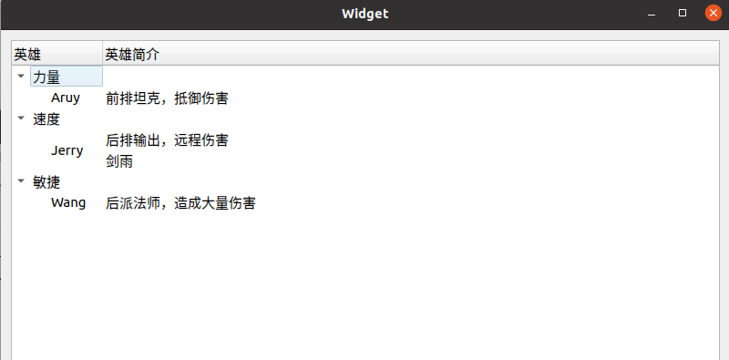
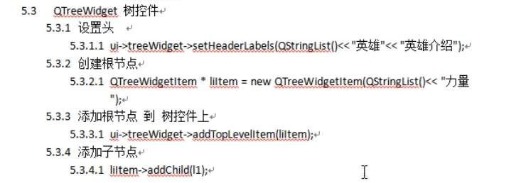
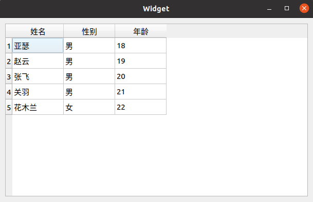
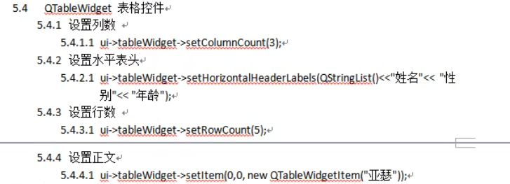

# Widget控件

> Item View控件需要基于数据库，Item Widget基于项目


## QListWidget控件

> 


```c++
    //利用QListWidget写诗
    QListWidgetItem *item = new QListWidgetItem("床前明月光");
    //将一行诗放入ListWidget控件
    ui->listWidget->addItem(item);
    //对齐格式 enum Qt::alignMent
    item->setTextAlignment(Qt::AlignCenter);

    //QStringList QList<QString>：元素为QString格式的Q链表
    QStringList list;
    list << "疑是地上霜" << "举头望明月" << "低头思故乡";
    ui->listWidget->addItems(list);
```

```c++
addItems(Iterable[str]) 其参数为一个可迭代的类型,其中的元素为字符串。 items = ['item1','item2','item3'] self.listWidget.addItems(items)
```


## QListWidget树控件

> 能够打开与折叠的文本控件







```c++
//treeWidget树控件使用
        //设置水平头，匿名对象
    ui->treeWidget->setHeaderLabels(QStringList()<< "英雄" << "英雄简介");

    QTreeWidgetItem *item1 = new QTreeWidgetItem(QStringList() << "力量");
    QTreeWidgetItem *item2 = new QTreeWidgetItem(QStringList() << "速度");
    QTreeWidgetItem *item3 = new QTreeWidgetItem(QStringList() << "敏捷");
    //加载顶层节点
    ui->treeWidget->addTopLevelItem(item1);
    ui->treeWidget->addTopLevelItem(item2);
    ui->treeWidget->addTopLevelItem(item3);
    //也可以
//    ui->treeWidget->addTopLevelItems(QList<QTreeWidgetItem*>() << item1 << item2 << item3);

    //追加子结点
    QTreeWidgetItem *l1 = new QTreeWidgetItem(QStringList() << "Aruy" << "前排坦克，抵御伤害");
    item1->addChild(l1);
        //输出换行符
    QTreeWidgetItem *l2 = new QTreeWidgetItem(QStringList() << "Jerry" << QString::fromUtf8("后排输出，远程伤害\n剑雨"));
    item2->addChild(l2);
        //字符串多于顶层节点的会被忽略
    QTreeWidgetItem *l3 = new QTreeWidgetItem(QStringList() << "Wang" << "后派法师，造成大量伤害" << "1111");
    item3->addChild(l3);
```


## QTableWidget表格控件

> 设置表格的控件，能够垂直/水平排布







```c++
    //TableWidget控件
    //设置列数
    ui->tableWidget->setColumnCount(3);

    //设置水平表头
    ui->tableWidget->setHorizontalHeaderLabels(QStringList()<< "姓名" << "性别" << "年龄");
    //设置垂直表头ui->tableWidget->setVerticalHeaderLabels();

    //设置行数
    ui->tableWidget->setRowCount(5);
    //设置列数： setColumnCount();

    //设置正文,参数：行，列，变量
    //ui->tableWidget->setItem(0,0,new QTableWidgetItem("亚瑟"));
        //String链表储存
    QStringList nameList;
    nameList << "亚瑟" << "赵云" << "张飞" << "关羽" << "花木兰";

        //List链表储存
    QList<QString> sexList;
    sexList << "男" << "男" << "男" << "男" << "女";


    for(int i=0;i<5;i++)
    {
        int col = 0;
        ui->tableWidget->setItem(i,col++,new QTableWidgetItem(nameList[i]));
        ui->tableWidget->setItem(i,col++,new QTableWidgetItem(sexList.at(i)));
        //int转QString
        ui->tableWidget->setItem(i,col++,new QTableWidgetItem(QString::number(i+18)));
    }
```

