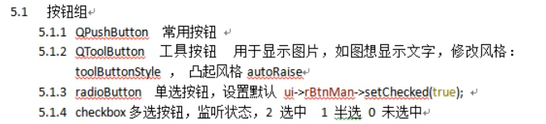
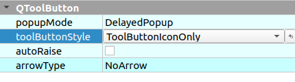

# 按钮控件

## ToolButton

可以专门显示图片

在toolButtonStyle中可以设置显示方式

autoRaise属性能够在选中时自动凸起

## RadioButton

> 单选按钮

通过`ui->XXX->setChecked(true)`来设置默认

## CheckButton

> 多选按钮

除了继承的信号外，还有一个自己的信号stateChanged，2是选中，0是未选中，1是半选(属性qCheckBox的tristate选中)