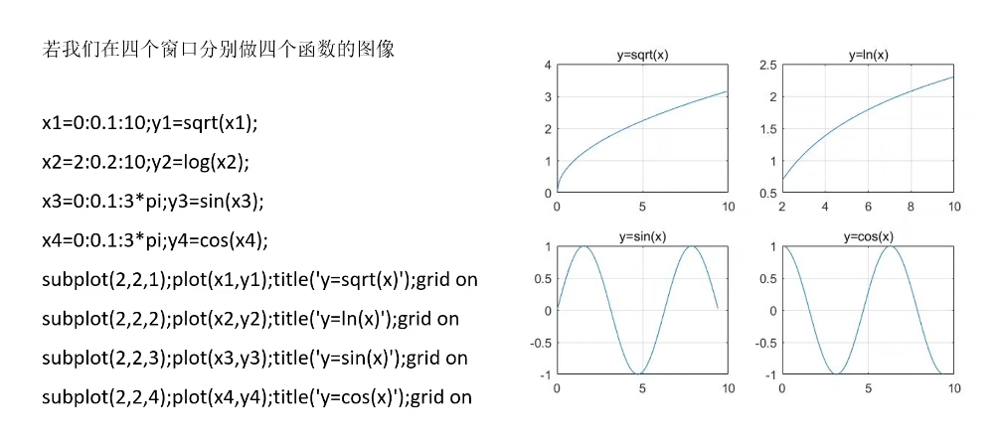

# 数学建模

## 论文结构

> **1.摘要**
>
> 题目讲解与本文主要研究：
>
> 针对问题一，通过xx特点，选择xx方法 + 特征数据
>
> 针对问题二
>
> ...
>
> **2.关键词**
>
> 算法，建模方法
>
> **3.1问题重述+问题要求**
>
> 问题一：
>
> 问题二：
>
> ...
>
> **4.问题分析**
>
> 对问题一的分析：XX的特征由此可以选用XX方法
>
> 对问题二的分析
>
> ...
>
> **5.1模型假设**
>
> 将实际问题抽象成模型（假设）
>
> 符号说明
>
> **5.2模型建立和求解**（一个问题一个模型）
>
> 画出并描述抽象后的模型
>
> 问题的提出及对传统方法的优化
>
> 运算后的分析
>
> **6.1模型评价**
>
> 优点，创新点和缺陷
>
> **7.附录**
>
> 代码
>
> **8.参考文献**


# 回顾：Matlab

## 多窗口绘图





## 绘制直角坐标图形


最后的参数可以规定属性


**实例**


```c
清除参数
 设置x范围0-2pi，分度值0.1
```


## 绘制极坐标平面图形


**实例**


## 绘制直方图


**实例**


## 绘制三维曲线


## 绘制三维曲面


### mesh函数


### surf函数


## 其他


```c
实例
x=1:0.1:10;

y=x;

plot(y);

axis square;
```

