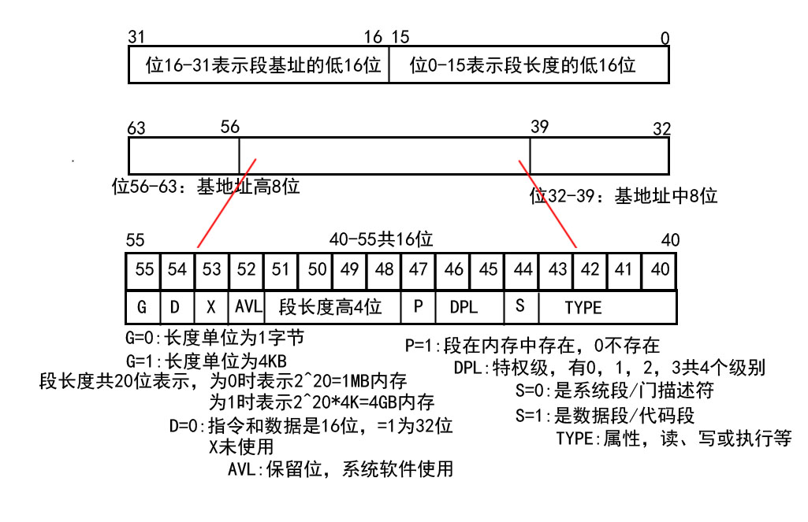
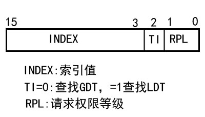
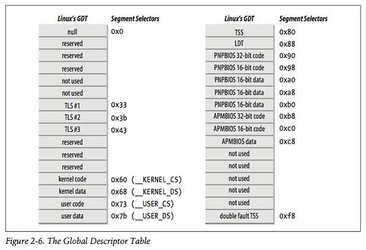

# 描述符表

> 从文档1中我们已经初步了解了全局描述符表GDT和局部描述表LDT，在本文档我们将会更深入地了解描述符表。


## GDT

> GDT全称为`Global Descriptor Table`,全局描述符表。
>
> 保护模式的寻址方式不在使用寄存器分段的方式直接寻址方式。而采用的是使用GDT（全局分段描述表）来寻址。从而使用更多的内存地址。

单处理器系统只有一张全局描述符表，多核处理器则每个CPU各有一张描述符表。所有的GDT都储存在`cpu_gdt_table`数组中，相应的地址与大小则在`cpu_gdt_descr`数组，用于初始化gdtr寄存器使用。

```c
上述数组与其他符号都位于arch/i386/kernel/head.S文件。
```


### 实模式与保护模式

> 当计算机启动后，我们进入的是实模式，而实模式的内存寻址方式是通过：`段值 × 16 + 偏移 = 物理地址`。这样只能具有1MB的寻址能力。如果想要更为强大的寻址能力，就必须通过一定机制，进入具有更强大寻址能力的保护模式。
>
> 保护模式能够提供强大的寻址能力并提供内存保护，以防止用户程序改写内核代码和为操作系统提供更好的硬件保障。

GDT进入的就是保护模式，它仍然使用段值加偏移这样的寻址方式，但是更复杂，功能也更多样。如你所见，GDT为寻址增加了索引的过程。



​                                                                                                                   $$段描述符$$



​                                                                                                             $$段选择符$$

  [参考](https://blog.csdn.net/wenwushq/article/details/79805779)


### 结构

> 每个GDT包含18个段描述符和14个保留项。
>
> `保留项用于与其他描述符处于同一32字节的高速缓存器`(硬件高速缓存)


上图：GDT/LDT的18个段描述符（P49)

- 4个用户态与内核态下的段描述符
- 任务状态段(TSS),每个处理器有一个。仅能由内核态访问
- 1个包括缺省局部描述表的段，通常由所有进程共享（下一节)
- 3个局部线程储存(Thread-Local Storage,TLS)段，该机制允许多线程程序使用这些段(因此该线程最多只能用3个)

```c
系统会调用set_thread_area()和get_thread_area()为正在执行的进程创建和撤销一个TLS段
```

- 3个与高级电源管理(AMP)相关的段

```c
BIOS代码会使用该段，因此Linux APM驱动程序调用BIOS函数获取或设置APM设备时，就能自定义使用代码段，数据段。
```

- 5个支持即插即用(PnP)功能的BIOS服务程序相关段

```c
同上，由于BIOS例程使用段，因此Linux的PnP设备驱动程序调用BIOS函数检测PnP设备资源时，可以自定义使用代码段，数据段。
```

- 用于处理"双重错误"异常的特殊TSS段

```c
//双重错误:一个异常可能会引起另一个异常，这种情况称为产生双重错误
```


### 小结

我们知道，每个处理器都会有一张GDT，通常情况每张GDT会存放相同表项。.

- 每个处理器有自己的任务状态段TSS，因此对应的GDT不同
- GDT的少数项依赖正在执行的进程(LDT和TLS段描述符)
- GDT可能会临时修改项

```c
例如：调用APM的BIOS例程。
```


## LDT

> LDT表是一种系统段，其描述符属于系统段描述符。
>
> 大多数Linux用户态不会使用局部描述符表，因此内核定义一个缺省的LDT给大多数进程共享，它存放于`default_ldt`数组。
>
> 该缺省的LDT有5个项，但内核仅调用2个：用于执行调用门(二十章)

（P50）




当然，进程也可以为自己创建LDT，例如Wine一类的面向段的微软应用程序。`modify_ldt()`函数用于进程创建自己的局部描述符表。

```c
类似于指针变量也需要分配空间，由modify_ldt()创建的LDT也需要自己的段。处理器执行有自定义LDT的进程时，CPU的GDT副本里的LDT项也需要得到修改。
用户态下同样使用 modify_ldt() 函数分配新段，不过内核并不会使用这些段
```

