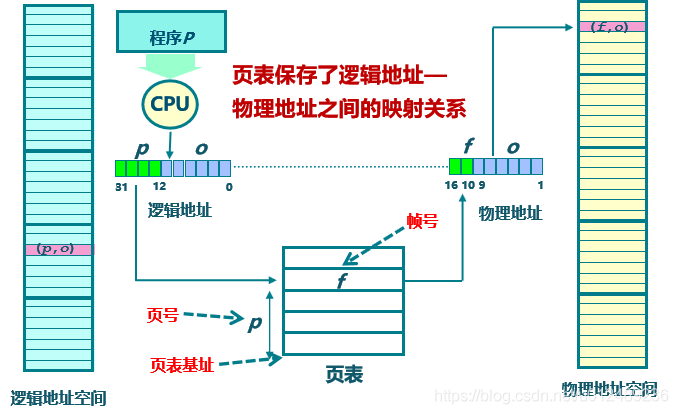
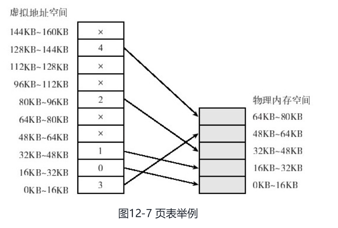
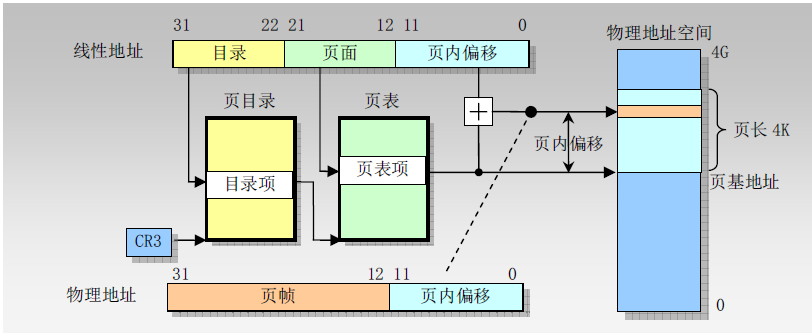
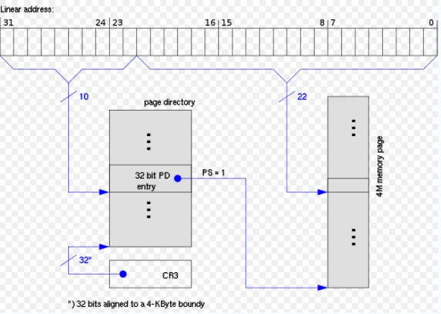
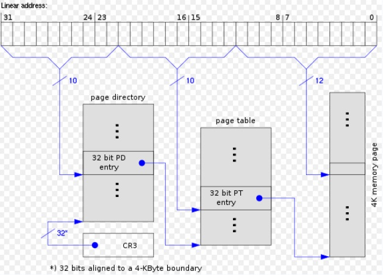
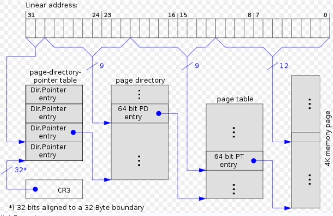
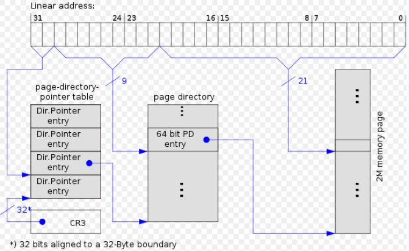

# 分页

P50

> 分页单元将线性地址空间转化为物理线性地址。它的一个关键任务是将请求的访问类型与权限比较，如果内存访问无效，则返回一个缺页异常。
>
> 分段与分页都可以划分物理地址空间。分段可以给**一个进程分配不同线性地址空间**；分页可以把**同一线性地址空间映射到不同的物理空间**。

**相较于分段**

```c
分段通过抽象出地址，简化了程序员的编程结构，解决了之前操作系统存在的两个问题：
//地址空间没有隔离
//程序运行的地址不确定
分段机制也存在严重的问题，在分段的映射方法中，并没有解决内存使用效率的问题。如果应用程序过多，或者内存碎片过多，又或者曾经被换出到硬盘的内存段需要再重新装载到内存，可内存中找不到合适大小的区域，要如何解决这个问题，就引入了分页机制,而分页的搭积木一样的内存分配机制能够很好地缓解这些问题。
```


## 页

> 为提高效率，线性地址分为了一定长度的组，称为页(page)。每一页大小由硬件来决定，或者是由操作系统来决定
>
> 内核可以单独指定一个页的**物理地址和储存权限**，通常而言，我们所说的页即指一组线性地址，也指这组地址的数据。

```c
1.将进程的逻辑地址空间分成若干个大小相等的片，称为页面或页
2.内存空间分成与页大小相等的若干个存储块，称为物理块或页框
3.在为进程分配内存时，以块为单位，将进程中的若干页分别装入多个可以不相邻的块中
关于进程分页，当我们把进程的虚拟地址空间按页来分割，常用的数据和代码会被装在到内存；暂时没用到的是数据和代码则保存在磁盘中，需要用到的时候，再从磁盘中加载到内存中即可.
```

​	简单来说，线性地址被分页处理后，如同积木一样被内存装载。


> 分页单元将所有RAM先分成页框，每个页框含一个页。注意区分二者，前者是储存区块，后者只是一块数据。（所以后者可储存至任何页框与磁盘）	


## 页表

> 页表用于将线性地址映射到物理地址，页表储存在主存（内存）中。启用分页前内核对页表进行初始化。
>
> 作用是实现从页号到物理块号的地址映射。

cr0寄存器的PG标志用于指定是否分页(PG=0时线性地址解释为物理地址)


逻辑地址转换成物理地址的过程是：

- 用页号p去检索页表，从页表中得到该页的物理块号，把它装入物理[地址寄存器](https://baike.baidu.com/item/地址寄存器)中。

- 将页内地址d直接送入物理[地址寄存器](https://baike.baidu.com/item/地址寄存器)的块内地址字段中。

  这样，物理[地址寄存器](https://baike.baidu.com/item/地址寄存器)中的内容就是由二者拼接成的实际访问内存的地址，从而完成了从[逻辑地址](https://baike.baidu.com/item/逻辑地址)到物理地址的转换。


### 页表信息

> **内存管理单元依赖页表来进行一切与页面有关的管理活动**。这些活动包括判断某一页面号是否在[内存](https://so.csdn.net/so/search?q=内存&spm=1001.2101.3001.7020)里，页面是否受到保护，页面是否非法空间等。因此，页表除了提供虚拟页面到物理页面的映射外，还记录这些相关信息。


```c
缓存禁止位 
    //用来指示该页面是否允许存放在缓存里。访问位记录该页面是否被访问过（被读过或者被写过）。
修改位 
    //记录该页面自从加载到物理内存后是否被修改过。
保护标识位 
    //记录该页的受保护情况，如是否允许读、写、执行等。
在内存否 
    //记录该虚拟页面是否已经在物理内存里。物理页面号则是该虚拟页面对应的物理页面（如果该虚拟页面在物理内存的话）。
   
一个记录条通常还会有一个保留区（reserve area），图12-6没有给出该保留区。但它通常是存在的，目的是为以后有需要时增加信息用
```


### 一级页表

> 硬件上使用一级页表的方式是最简单的，访问效率也最高，页面的大小一般为 4KB。为了能够定位和访问每个页，需要有个页表，保存每个页的起始地址，再加上在页内的偏移量，组成	线性地址。



虚拟地址(与逻辑地址没有明显界限)分为两部分，页号p和页内偏移(o)。页号(用高 20 位表示)作为**页表的索引**，页表包含物理页每页所在物理内存的基地址。这个基地址与页内偏移o(低 12 位)的组合就形成了物理内存地址。


下图展示虚拟地址下，页表映射到物理内存的示意图，左侧的每一个小框是页表项，它类似于页的“门牌”



```c
在32位环境下，虚拟的地址空间为4GB，如果采用一级页表，采用4KB为一个页，那就需要1M个页表项。
每一个页表项需要4个字节来存储，那么整个4GB的地址空间的映射就需要4MB的内存来存储页表。如果每个进程都有自己的页表，100个进程就需要400MB的内存，对于内核来说，确实有点大。

//原文链接：https://blog.csdn.net/u012294613/article/details/124114728
```


## 常规页表

> 如上述的一级页表，我们采用一级页表的方法极度占用空间。我们更多使用多级页表。现在我们讲述常规页表(二级分页)，二级页表会用页表项的一个字段指定是否将页存于主存。		

从80386起，intel的处理器的分页单元采用4KB的页。

4 X 8 = 32位的线性地址分成了三个域

```c
Directory（目录）
    //最高10位
Table(页表)
    //中间10位
Offest
    //最低12位
```

这时线性地址的转化分两步完成，每一步都需要一种转换表。分别是``页目录表``和``页表``。这是一种二级分页，相较于一级页表能够明显减少RAM的需求：一级页表会为分配足够数额的RAM来储存进程的所有页表(即使进程不使用一部分地址)，而二级页表只为实际被使用到虚拟内存区分配页表。

**总之，二级页表通过减少页表的方式减少RAM占用**


### 页目录表

> 每个进程都有一个分配给它的页目录表，不过该表不会马上为进程的所有页表分配RAM，当进程实际需要时才为一个页表分配RAM

页目录表的物理地址被储存在CR3寄存器中



寻址流程

- 线性地址中的Directory指定目录表的目录项，目录项会指向相应的页表
- Table字段指定页表中的表项，页表包含物理页每页所在物理内存的基地址
- Offest字段决定了页框相对位置

```c
Directory Table都是10位长，页目录表和页表都能储存1024项。因此寻址能够达到1024 X 1024 = 2^32个单元。这与32位地址期望一样
```


### 页目录项

> 页目录项和页表项有相同的结构。它有这些字段  （P52）

| 标志             | 功能                                |
| ---------------- | ----------------------------------- |
| Present          | 是否在主存(1/0)                     |
| Field            | 有物理地址高20位的字段              |
| Accessed         | 寻址和能否由操作系统使用的标志      |
| Dirty            | 写操作和能否由操作系统使用的标志    |
| Read/Write       | 页和页表的存储权限                  |
| Users/Supervisor | 访问页和页表的特权级                |
| PCD/PWT          | 硬件高速缓存处理页和页表的方式      |
| Page Size        | 设置页目录项的指向为2或4MB的页框(1) |
| Global           | 防止被高速缓存刷出去                |
|                  |                                     |


### 常规分页举例

> 假设内核为进程分配的线性地址空间范围是0x20000000到0x2003ffff(16进制，64个页)，请注意这些页可能并不在主存当中。
>
> 转化为二进制0002000000 0000000000000000000000(2后面4x7=28个0,并且2处发生进位) --> 0010000000000000000000000000000(1后面4x7 + 1 = 29个零)，分为三段：

| 地址(十六进制) | 前10位(二进制) | 中间10位(二进制) | 后12位(二进制) |
| -------------- | -------------- | ---------------- | -------------- |
| 0x20000000     | 0010000000     | 0000000000       | 000000000000   |
| 0x2003ffff     | 0010000000     | 0000111111       | 111111111111   |


- 如上，两个``0x20000000,0x2003ffff``的高10位是0010000000(**Directory字段**)，即**0x080**或十进制的**128**，则这两个地址的Directory字段都指向进程页目录的第129项。相应的页目录项含有分配给进程的页表的物理地址。

页目录有1024项，如果内核没有为这个进程分配除了129项的其他线性地址，那么其他1023项都为0


- 中间10位(**Table字段**),范围从0到0x03f，或十进制63。则第129项的页目录项所指向的页表的1024项中只有0-63项(前64项)有意义，其余1024-64=960的项为0.


- 后12位(**Offest字段**),通过从页表中获取的页框基址，加上即可得到物理地址。


现在我们假设进程需要读取0x20021406中的字节，分页单元会进行以下步骤：

1. Directory字段获取第129项的页目录项，它指向相关页表
2. Table字段选择第0x21项的页表项，它指向页框
3. Offest字段指定偏移量0x406的字节(B)


**区分是否在主存**

> 刚才我们说了这些线性地址可能不在主存，这主要是靠页表项的Present字段指定，若为0则不在主存。


**不在主存的影响**

> Present字段若为0,那么分页单元在线性地址的转化时会产生一个缺页异常。当然，除了页目录的129项外，其他页目录项的访问也会产生缺页异常，因为这些项都被填充为0，尤其是Present字段。


## 扩展分页

> 80x86微处理器起，页框可允许有4mb而不是4kb，这就是扩展分页。它能够将一大段线性地址转换为物理地址，此时内核不需要中间页表进行转换以节省空间。


```c
找不到图，扩展页表就是去除了上图的页表部分。
```

**线性地址**的32位被分为以下字段

```c
Directory
    //最高10位
Offset
    //其余22位
```


页表项的**Page Size**字段就标志是否启用扩展分页，扩展分页有以下要求

- **Page Size**字段必须设置

- 物理地址字段只有前10位有意义，因为4MB的边界下后22位为0  

  4MB->字节B = 4 X 1024 X 1024 = 4194304

  22位->字节 = 2^22 = 4194303


cr4处理器寄存器的PSE标志能使扩展分页与常规分页并存


# 硬件保护

> 分段和分页的硬件保护不一样。
>
> 特权级别通常有4种，分页仅有``User/Supervisor``标志控制的特权级，为0时只有CPL小于3(处理器位于内核态)时才可对页寻址，为1则总能对页寻址
>
> 分段有读，写，执行三种存取权限；对于页目录表项或页表项，仅有``Read/Write``标志控制的"读"与“写”，为0则相应页表或页只读，否则可读写。 


# 物理地址扩展(PAE)分页机制

## 解释

> 为了适应大型服务器对RAM的需求，Intel在处理器上将管脚数从32提升到了36(寻址能力达到2^36=64GB)。这时需要新的分页方式将32位线性地址转化为36位物理地址。这时我们采用**物理地址扩展(PAE)分页机制**
>
> 管脚有32位，那么数据能达到2^36^，此时采用4kb分页，那么有2^24^个页框，物理地址从20位扩展到24位。对于页表项而言，从32位扩展到36位，除了12个PAE必要的标志位(常规页表所提)之外还有24位物理地址，那么一个36位页表项与32位相比大小从32位到了64位，**大了一倍**(``（36位>32位，考虑到对齐，因此应将页表项扩大一倍到64位）``)。因此一个4KB的页表只能包含512个页表项而不是1024个。

详情请见P56与[链接](https://blog.csdn.net/brahmsjiang/article/details/114379195)

**进而对于线性地址而言，只需要9位(2^9 = 512)存储对页目录项的指定。同理，由于页目录项与页表项具有同样的结构，高一级的页目录表中也仅能包含512个页表项，同样占用了32位线性地址中的9位**。
**线性地址剩余位数为：32位（总位数）-12位（4KB的页的页内偏移量Offest）-9位（指示页表中的索引）-9位（指示页目录表中的索引）=2位**


Linux引入了一个**页目录指针表（PDPT）**的页表新级别，由4个64位表项构成，剩余的2位即用来指向PDPT中4个项中的一个。

cr3寄存器被用于存储一个27位的页目录指针表的基地址字段，通过该寄存器即可尝试获取4个表项中的一个。


## 寻址

> 可以通过设置cr4寄存器中的物理地址扩展(PAE)标志激活PAE，同时页目录项的页大小标志PS能够启用大尺寸页(PAE启用时为2MB)


**未启用PAE下的4MB分页的页表结构**




**未启用PAE下的4KB分页的页表结构**




**启用PAE下的4K分页的页表结构**



此时32位线性地址按以下方式解释

- cr3：          指向一个PDPT
- 位31-30：  指向PDPT四个项中的一个
- 位29-21：  指向页目录表512个项中的一个
- 位20-12： 指向页表512个表项中的一个
- 位11-0：    4KB页中的偏移量


**启用PAE下2M分页的页表结构**



- cr3：          指向一个PDPT
- 位31-30： 指向PDPT四个项中的一个

- 位29-21： 指向页目录表512个项中的一个
- 位20-0:      2MB页表的偏移量


## 疑问点

> P58：PAE没有扩大线性地址空间，只处理物理地址空间。由于只有**内核能够修改进程的页表**，所以用户态下的进程不能使用大于4GB的物理地址空间。

为什么大于4GB的用户态无法实现？

RAM大于4GB时形成的最终内核页表一节会描述Linux如何初始化页表，可能我会在这里会了解更多关于内核权限

目前我猜测原因是只有内核能够修改cr3寄存器(在其内新增一个值)或改变PDPT，以将寻址能力突破4GB.


# 64位系统分页

> 对于32位微处理器，前面我们更多的是了解到多级分页中的二级分页，不过这在64位系统中并不适合。
>
> 2^32^次方下内存寻址只有4GB，而2^64^会产生超过1亿GB寻址空间；另一方面，当我们使用64位线性地址寻址时。在减去12位标志位后，页目录表，和页表平均能分摊到二十多位，这意味着会产生巨量的项。因此64位系统需要更多级的分页，同时也不一定满打满算地使用64 - 12 = 52 位去向页表进行寻址

```c
32位和64位是指，CPU一次处理数据的能力是32位还是64位，这里涉及到的是处理器运算位数。
32位系统的地址总线是32位的，而64位系统的地址总线是64位的.
```

| 平台名称 | 页大小 | 寻址使用位数 | 分页级别数 | 线性地址分级 |
| -------- | ------ | ------------ | ---------- | ------------ |
| alpha    | 8KB^a^ | 43           | 3          | 10+10+10+12  |
| ia64     | 4KB^a^ | 39           | 3          | 9+9+9+12     |
| ppc64    | 4KB    | 41           | 3          | 10+10+9+12   |
| sh64     | 4KB    | 41           | 3          | 10+10+9+12   |
| x86_64   | 4KB    | 48           | 4          | 9+9+9+9+12   |

