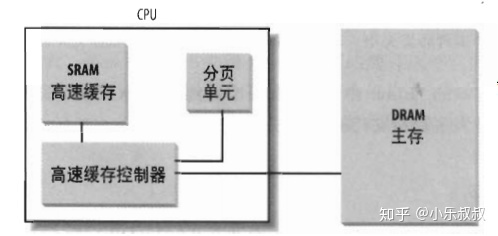
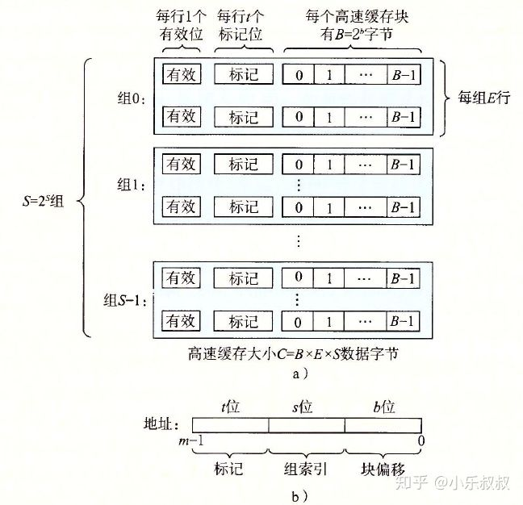

# 硬件高速缓存

P59

> 微处理的时钟频率能达到几个GHz，是动态RAM(DRAM)的数百倍，这也就意味着在向RAM存取一类的指令中，**CPU可能会等待很长时间**。
>
> 访问CPU寄存器中的数据，只需要一个时钟周期；访问高速缓存中的数据，大概需要几十个时钟周期；如果访问的数据在主存中，需要大概上百个周期；而访问磁盘中的数据则需要大约几千万个周期！因此我们应该了解存储器层次结构，让我们的程序尽可能得高效执行。
>
> 为此，我们引入**高速硬件缓存内存**，以减小CPU和RAM之间的速度不匹配。

```c
CPU的缓存作用在于短期内重复数据的快速访问，实际工作时，CPU往往需要重复读取同样的数据块，而缓存容量的增大，可以大幅度提升CPU内部读取数据的命中率，而不用再到内存或者硬盘上寻找，以此提高系统性能.
//注意： 缓存的调度是需要算法和指令集的支持的，如果过大，和核心数，总线频率不兼容的话可能根本无法正常工作
```

[参考](https://blog.csdn.net/mocas_wang/article/details/118960847)


## 行

> 高速硬件缓存是基于局部性原理(locality principle)，程序的循环结构和相关数组可以组成线性数组，而常用的的相邻地址在将来也用到的可能性也很大。因此我们引入小而快的的内存存放经常使用的的代码和数据。80x86中引入**行（Line）**这种新单位，行由几十个连续的字节组成。
>
> 它们可以在慢速DRAM和高速缓存片上的静态RAM(SRAM)之间传送，以实现高速缓存。**主存中任意一行和高速缓存中N个行的任意一行相关联。**

[参考](https://zhuanlan.zhihu.com/p/340573903)


## 高速缓存控制器

> 一般高速缓存只有几十KB，而主存有几GB甚至更多，系统就是通过高速缓存控制器来管理**缓存映射内存**。


### 概念

处理器硬件高速缓存：



> 高速缓存是由硬件来管理,它包含一个``硬件高速缓存内存``和一个``高速缓存控制器``。**高速缓存内存存放真正的行， 高速缓存控制器存放一个表项数组**，每一个表项对应高速缓存内存中的行。表项由**标签tag**（n位）和表示状态的几个flag组成。
>
> 标签能让高速缓存控制器辨别 line行映射的内存单元。在访问存储单元时，把物理地址高几位和物理地址子集提取的行的标签对比，相同则表示命中高速缓存。

```c
标签tag: 它由一些位组成,通过这些位,高速缓存控制器能够辨别这些行映射的内存单元.
    这种物理内存地址通常分为三组://高几位表示标签, 中间几位表示高速缓存控制器子集索引, 低几位表行内偏移量
```

从上图我们也可以看到，硬件高速缓存的"交通枢纽"就是高速缓存控制器，它将在访问RAM储存单元的扮演重要角色。


### 结构

假设这样一个系统，主存地址有m位，共有M=2^m个不同地址；高速缓存分成S个组，每个组E行，每行B个字节：




```C
每行由一个 B=2^b字节的数据块组成，一个有效位指明这个行是否包含有意义信息
还有t=m-(b+s)个标记位(tag bit)用于唯一标识存储在这个高速缓存行中的块。缓存总大小为C=BxExS。
```

**↑** 这种缓存结构被称为：**组相联高级缓存**：

1. E等于1的时候称之为“**直接映射高速缓存**”，此时主存中的一个行总是在高速缓存中完全相同的位置
2. E等于C/B即一个组包含所有行的时候称之为“**全相联高速缓存**”，此时主存中的任一行可以存放在高速缓存任意位置

每个组中行数E越多，硬件设计越复杂，成本就越高。但好处是标记内存地址的t位会越多，可以映射更多内存，即越不容易出现cache thrashing。


### 访问RAM储存单元

> 访问一个RAM储存单元时，CPU从物理地址获取子集的索引号后将子集的行标签与物理地址高几位比较。**如果标签与高位相同，则CPU命中一个高速缓存（cache hit），否则高速缓存没有命中 (cache miss)**

在命中时，根据存取类型，高速缓存控制器做出不同操作：


#### 读操作

> 控制器从高速缓存行中选择数据并送到CPU寄存器，此时并不需要访问RAM，极大地提高了访问速度


#### 写操作

> 写操作会涉及写高速缓存+DRAM 和 只写 高速缓存两种情况,分别称之为**通写(write-through)**和**回写(write-back)**
>
> 通写时，控制器既写RAM也写高速缓存行，OS发送的处理data的请求，一直要等到全部memory里面的data正确写到稳定存储media(如硬盘)中，然后返回给OS报告处理完毕，然后OS才会去update其状态。
>
> 回写时，只更新高速缓存行，OS发送处理data的请求后，该算法会将它用buffer存起来，并在没有正确写到稳定存储media(如硬盘)中前，就告诉OS处理完毕，然后OS就会去update。
>
> **linux中对于所有的页框都启用高速缓存，对于写操作总是采用回写策略**

```c
注意：回写结束后，RAM必须被更新。
    在CPU执行一条要求刷新高速缓存表项的指令或一个FLUSH硬件信号产生(通常在高速缓存未命中后)时，高速缓存控制器将高速缓存行写回到RAM。
```


**写操作的通写模式**

直写到主内存的好处是它简化了计算机系统的设计。使用直写功能时，主存储器始终具有该行的最新副本。所以当读取完成时，主存储器总是可以回复所请求的数据，在直写中，高速缓存行可以始终无效，因为内存中已经有最新的行副本。


**写操作的写回模式**

CPU写入数据时，不直接将数据写入内存，而是写入DCdcache，当**高速缓存(dcache)**数据被替换出去时才写回主存。 

如果使用回写，有时最新的数据位于处理器缓存中，有时位于主内存中。如果数据位于处理器高速缓存中，那么该处理器必须停止主存回复读请求，因为主存可能有一个陈旧的数据副本。

> 	**这比直写更复杂**————并不是所有的dcache中的数据都被修改过，因此没必要把所有替换出去的数据都重新写入主存。 
> 为了表示哪些数据被修改过(dcache中是数据和主存中的数据是否不一致)，dcache中每一块增加了一个**记录信息位**，CPU修改过的DCdcache时，设置此记录信息位(此时数据块为**脏的(dirty)**, cache数据写入到主存时清理此位(此时数据块为**干净的(clean)**。 
> 有了记录信息位，数据从dcache替换到主存时只替换脏的数据块即可)，


**为什么有写回模式 **
cache速度远大于RAM(主存)。通过DCache吸收系统的写操作，在必要的时候再统一写入主存，从而减少频繁的相对较慢的对主存的写操作，这样明显能加速系统。同样的思想在主存与磁盘中也存在。


### 高速缓存侦听

> 多处理器系统每一个处理器都有一个单独的硬件高速缓存，那么它们就需要额外的硬件电路以保持同步。

每个CPU如果修改了它的高速硬件缓存，它就需要数据是否包含在其他的硬件高速缓存中，如果是，它就必须通知其他CPU用适当的值更新。这种活动称之为高速缓存侦听(cache snooping). 这些通常由硬件级处理，内核无需关心。


## 多级缓存

> 高速缓存的技术发展十分迅速，现在已经有了L1-cache，L2-cache，L3-cache等的片上面的缓存。多级缓存的一致性由硬件决定。

一种典型的存储器层级结构如下：


```c
高速缓存是插在CPU寄存器和主存之间的缓存存储器，称为L1高速缓存，基本是由SRAM（static RAM）构成，访问时大约需要4个始终周期。刚开始只有L1高速缓存，后来CPU和主存访问速度差距不断增大，在L1和主存之间增加了L2高速缓存，可以在10个时钟周期内访问到。现代CPU又增加了一个更大的L3高速缓存，可以在大约50个时钟周期内访问到它
```

> 一级缓存常常用来存储“指令集”，通俗的说，就是最最常用的“算法规则”。大多数处理工作中都需要使用的算法工具。一级缓存的技术难度和制造成本最高，提高容量所带来的技术难度增加和成本增加非常大,而且现有的一级缓存的命中率已经很高，所以一级缓存是所有缓存中容量最小的.
>
> 二级缓存一般就可以存放相对次要一点的工具。
>
> 一级缓存直接与CPU数据总线相连，传输速度接近于CPU处理速度。而二级缓存主要是进一步过度一级缓存和内存直接的传输速度差。
>
> CPU缓存（Cache Memory）是位于CPU与内存之间的临时存储器，它的容量比内存小的多但是交换速度却比内存要快得多。缓存的出现主要是为了解决CPU运算速度与内存读写速度不匹配的矛盾。


几个关键的层次访问速度：

| 存储器       | 访问速度(clock) |      |
| ------------ | --------------- | ---- |
| CPU寄存器    | 1               |      |
| SRAM高速缓存 | n               |      |
| DRAM主存     | 10n ~ 100n      |      |


**高速缓存的启用**

处理器的cr0寄存器的**CD标志位**用于启用或禁用高速缓存电路。**NW标志**则表示采用通写还是回写策略。

Pentium处理器的一个特点是将不同的高速缓存管理策略与每一个页框相连。每一个页目录项和页表项都有两个标志位：

- **PCD(Page Cache Disable)标志位**： 表示访问页框数据时，高速缓存必须启用或者是禁用。

- **PWT(page Write-Through)标志位**： 表示当把数据写到页框时，必须使用回写还是通写。


==由于Linux清除了所有页目录项和页表项的PCD，PWT标志，所以所有的页框都启用高速硬件缓存，写操作也采用回写策略。==


# 转换后援缓冲器(TLB)

> 除了通用硬件高速缓存外，80x86处理器还有另一个转换后援缓存器(Translation Lookaside Buffer)的高速缓存用于加速线性地址的转换。
>
> 一个线性地址第一次被使用时，通过慢速访问RAM中的页表而获取到的物理地址会被**存放到TLB表项**，使得下一次使用该线性地址时可以快速转换。

多处理器系统的，为一个CPU都有自己的TLB，称为本地TLB，和硬件高速缓存不同的是TLB的对应项不必同步————因为运行现有CPU上的进程可以使用同一线性地址与不同的物理地址发生联系。

```c
假如一个现有的线性地址，它根据对应TLB表项的不同，在不同的CPU上所对应的物理地址也不一样，这样以来也就不必要保持同步了。
```

注意：当CPU的cr3寄存器被修改时，本地的TLB也将自动无效，因为新的页表被启用而TLB仍使用着旧数据，访问此时的TLB所获取的物理地址显然不是CPU想要的。