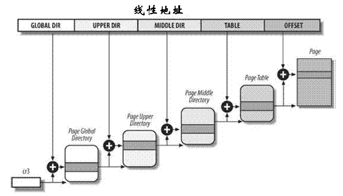

# Linux中的分页

## 四级分页

> P62 Linux采用既适合32位系统也适合64位系统的分页机制，至2.6.11版本开始，Linux采用四级分页。

首先展示Linux下的四级页表

- 页全局目录(Page Global Directory)
- 页上级目录(Page Upper Directory)
- 页中间目录(Page Middle Directory)
- 页表(Page Table)


```c
页全局目录包含若干页上级目录的地址，页上级目录又包含若干页中间目录地址，页中间目录则包含若干页表的地址。每一个页表指向一个页框，页框地址与偏移量相加即可得到物理地址。如此我们寻址用的线性地址分为了五个部分：
```




### 32位系统下的分页

> 我们知道32位系统只需要二级分页即可，而采用四级分页的Linux是为了适配64位系统下的分页需求，如此一来在32位系统下那多出来的两级分页会如何处理呢？

对于32位系统下多出来的两级页表，Linux会使页上级目录位，页中间目录位**为0**而从根本上取消了页上级目录和页中间目录字段。不过它们在指针序列中的**位置会被保留**，以便相同的代码在64位系统下也可以通用。==这是内核把它们的页目录项数设为1.并把这两个页目录项映射到页全局目录下而实现的——内核为页上级目录和页中间目录保留了一个位置。==


### 物理地址扩展下的分页

> 启用物理地址扩展的32位系统，其寻址能力将达到2^36^，此时二级分页明显不够用了，因此Linux系统使用了三级分页。

Linux系统下的页全局目录表对应80x86的页目录指针表(PDPT),也就是由4个64位表项构成的那个页表新级别。同时取消了页上级目录，页中间目录对应80x86的页目录表，Linux的页表对应80x86的页表。


**最后，64位系统对应使用三级还是四级的分页，还是取决于对线性地址位的划分。**


## 进程处理

> Linux的进程处理很大程度上依赖分页，因为线性地址可以转换到物理地址这一机制的存在，我们可以使用以下方案：

- 给每一个进程分配一个**不同的物理地址空间**，这样可以有效避免寻址错误
- 区别页与页框，灵活地把**页(一组数据)**装载进不同的**页框(主存的物理地址)**当中。(第十七章)


在第九章中，我们可以看到每一个进程都有自己的页全局目录表和页表集，发生进程切换时(第三章),Linux会把控制寄存器的内容保存在前一个执行进程的描述符中，接着把下一个要执行进程的描述符的值装入cr3寄存器。因此，新进程重新开始在CPU上执行时，分页单元可以指向正确的页表。


P64-P70展示一些查找地址和常用表格时常用的函数和宏


