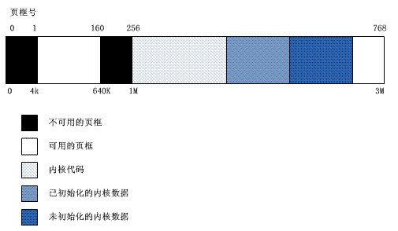

# 物理内存

> 物理内存（Physical memory）是相对于虚拟内存而言的。物理内存指通过物理内存条而获得的内存空间，而虚拟内存则是指将硬盘的一块区域划分来作为内存。当物理内存不足时，可以用虚拟内存代替。在应用中，自然是顾名思义: 在内存条上显示的内存。


## 物理内存布局

> 在初始化阶段内核必须建立一个物理地址映射来指定哪些物理地址范围对内核可用和不可用(或者因为它们映射硬件设备I/O的共享内存；或者相应页框有BIOS数据)

```c
I/O（Input/Output）: 计算机接口，即输入/输出，通常指数据在内部存储器和外部存储器或其他周边设备之间的输入和输出。
```

内核将以下页框标记为**保留**：

- 不可用的物理地址范围内的页框。
- 含有内核代码和已初始化的数据结构的页框

==保留页框的页绝不能被动态分配或交换到磁盘上==


### 保留的1MB

> 一般来说，Linux的内核安装在RAM从物理地址0x00100000开始的地方，而**0x00000000-0x00100000恰好是1MB的内存空间，这也就意味着Linux内核安装从第2MB开始**。Linux的内核安装所需的页框总数依赖于内核的配置方案，典型配置所得到的内核可以被安装在小于3MB的RAM中。

不过，为什么内核没有安装在RAM的第一个MB开始的地方? 因为PC体系结构有一些独特的地方需要考虑：

- 页框0由**BIOS**使用，存放**加电自检(Power-On Self-Test,POST)**期间检查到的系统硬件配置。

- 物理地址从0x000a0000到0x000fffff的范围通常留给BIOS例程，并且映射ISA图形卡的内部内存。

  ``这个区域是所有IBM兼容PC从640KB到1MB之间著名的洞：物理地址存在但是被保留，对应的页框不能被操作系统使用``

- 第一个MB内的页框可能被特定计算机模型保留。例如IBM Thinkpnd把0xa0页框映射到0x9f页框。


在启动的早期阶段(附录1)，内核询问BIOS并了解物理内存的大小。在新近的计算机中，内核也调用BIOS过程建立一组物理地址范围和对应的内存类型。之后内核执行``machine_specific_memory_setup()``函数，该函数建立物理地址映射(下表)，**如果这张表不可获取，那这张表会被缺省设置: 从0x9f到0x100号的页框标记为保留。**

|    开始    |    结束    |   类型    |
| :--------: | :--------: | :-------: |
| 0x00000000 | 0x0009ffff |  Usable   |
| 0x000f0000 | 0x000fffff | Reserved  |
| 0x00100000 | 0x07feffff |  Usable   |
| 0x07ff0000 | 0x07ff2fff | ACPI data |
| 0x07ff3000 | 0x07ffffff | ACPI NVS  |
| 0xffff0000 | 0xffffffff | Reserved  |

上表是128RAM计算机的典型配置。

```c
从0x07ff0000到0x07ff2fff的地址范围内存有加电自检(POST)阶段由BIOS写入的硬件设备信息，在初始化阶段，内核将这些数据拷贝到一个合适的内核数据结构中，并认为这些页框是可用的。
从0x07ff3000到0x07ffffff的物理地址范围被映射到硬件的ROM芯片(附录1)
从0xffff0000开始的物理地址标记为保留，因为它由硬件映射到BIOS的ROM芯片。
```

注意，BIOS不一定提供全部物理地址范围的信息(例如上表的0x000a0000到0x000effff),为安全起见，Linux假定这些范围是不可用的。


**内核可能不会见到BIOS报告的所有物理内存**：例如，如果未使用PAE支持来编译，即使有更大的物理内存，内核也只能寻址4GB大小的RAM。

P72提供了一些变量描述内核物理内存的布局：

| 变量名称        | 说明                                               |
| --------------- | -------------------------------------------------- |
| num_physpages   | 最高可用页框的页框号                               |
| totalram_pages  | 可用页框的总数量                                   |
| min_low_pfn     | RAM 中在内核映像后第一个可用页框的页框号           |
| max_pfn         | 最后一个可用页框的页框号                           |
| max_low_pfn     | 被内核直接映射的最后一个页框的页框号（低地址内存） |
| totalhigh_pages | 内核非直接映射的页框的总数（高地址内存）           |
| highstart_pfn   | 内核非直接映射的第一个页框的页框号                 |
| highend_pfn     | 内核非直接映射的最后一个页框的页框号               |


**前1MB里，我们可以看到有些区块是内核能用的，但却是分散的。为了避免把内核装入一组不连续的页框里，Linux选择跳过RAM的第一个MB**。明确而言，Linux用PC体系结构未保留的页框来动态存放所需要分配的页。


下图显示Linux如何填充前3MB的RAM(内核需要小于3MB的RAM的情况下)



```c
在1M处是符号_test，对应于物理地址0x00100000，表示内核第一个字节的地址。
    //内核数据分为两组:未初始化的和初始化的数据
_etext表示内核初始化数据的开始位置，到_edata结束。
_edata也表示内核未初始化的数据开始位置，到_end结束。
    
    //这些符号没有在Linux源码中定义，它们在编译内核时产生。
```

