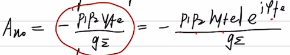

# 第三章


## 高频小信号谐振放大器

课本P57

> 高频小信号放大器分为三部分，第一部分是最左侧的输入端，第二部分是T1管的的输出到T2管的输入这部分(第二级)，第三部分是负载

P58

> 对应于它的等效电路，首先根据P53的y等效分析，我们得到了T1管的**输入导纳yie**和**输出导纳yoe**(题目通常会直接给)还有三极管的**yre**。

对于电感，由于在高频中Vcc等效接地，所以在P57的等效电路里1端是接地的，与P58里的上下颠倒。

对于输出端，因为前一级的输出导纳是下一级的输入导纳，所以用yie2等效

```c
//yre是什么？
在高频小信号谐振放大电路的等效电路中，yre通常是指输出端的等效电阻。它是指放大电路的输出端产生的交流电压与输出电流之比的电阻值。yre一般是由输出电阻和负载电阻共同构成的。
    题目中yre通常为0
```


P59

> 由于通常yfe=0，我们去除等效电路里的输入端部分，根据P25的品质因素将不同匝数的电感统一等效成L13
>
> 同时根据导纳y = g + j*C将第一级输出导纳yoe和第二级输入导纳yie2拆分
>
> 最后将电感等效并联电导g0并上，最终得到(b)图


**技术指标**

- 电压增益Au0和|Au0 |     P59

电压增益本身是复数，但我们通常求它的模(P60).

也可以使用模的方式表示复数形式：



```
e的指数里的虚部系数通常题目会给
```


多级电路的电压增益是各级增益相乘


- 功率增益Apo

1. 谐振时的最大增益


2. 有损耗下的功率增益

==失配损耗==：

**失配系数** P60最后一行

n=1时功率匹配，通常是匹配的

​	**功率匹配**  P61第11行

​	如果题目提及功率匹配，那么满足该关系式

插入损耗：  P61 前5行


- 通频带 2▵f0.7   P63

公式需要QL，根据P59的公式2，可以根据谐振频率，电感和总电导求出QL

随级数增加减小


- 矩形系数 2▵f0.1 P63

公式需要QL，求法同上

随级数增大减小，单级下是根号99


### 习题

P83

- 求C

f0已知，根据P59公式1，获得C累加

再将C累加表示出来，C加上其他电容等与C累加

减去后得到C


- Auo

根据P60基本表达式，注意负号